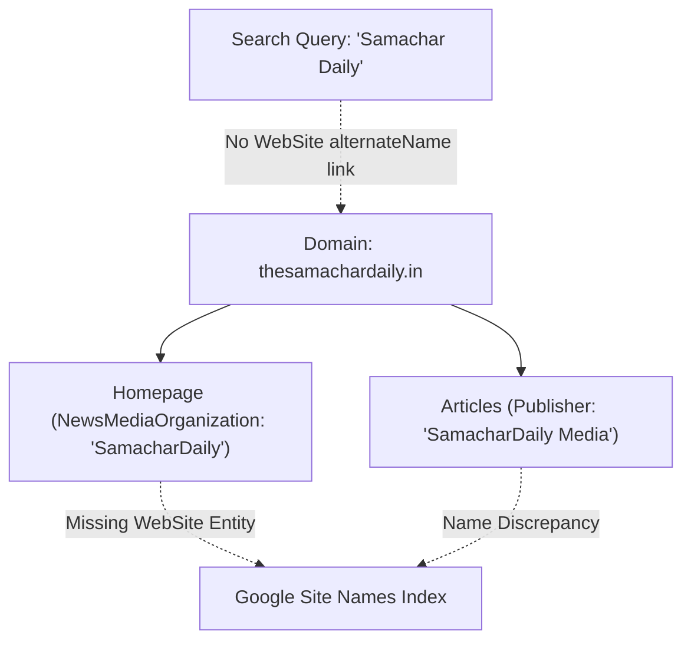

# PHASE 10A — SAMACHARDaily BRAND IDENTITY & PUBLISHER ENTITY FORENSIC AUDIT

**Project:** SamacharDaily SEO Rehabilitation  
**Date:** September 23, 2026  
**Scope:** Strictly READ-ONLY Forensic Audit of Brand Identity, Publisher Entity, Favicons, and Entity Graph Signals  
**Live Production URL:** `https://thesamachardaily.in/`  
**Current Deployed Commit:** `c1570695f1eabf1f1046e762c17c064facf52947`  
**Final Status:** **PHASE 10A COMPLETE — READ-ONLY BRAND IDENTITY AUDIT**  

---

## 1. Executive Summary

This forensic audit investigates the public brand identity, publisher entity signals, favicon/logo implementation, and search-engine entity graphs of SamacharDaily.

### Core Problem Statement
1. **Query Discrepancy:** Searching for the exact domain token `"thesamachardaily"` successfully surfaces the website, but the bare two-word brand query `"Samachar Daily"` fails to consistently surface the homepage as the primary authority result.
2. **Missing Brand Favicon in SERPs:** Search engines (including Brave Search and Google) display a generic placeholder globe icon rather than the SamacharDaily brand mark.

### Proven Root Causes from Forensic Analysis
* **Favicon Architecture Defect (Critical):** The site provides only an SVG icon (`/assets/images/favicon.svg`). The root `/favicon.ico`, `/apple-touch-icon.png`, and raster PNG icons (16x16, 32x32, 48x48, 192x192) are **completely missing and return HTTP 404**. Search engine snippet fetchers specifically request `/favicon.ico` and 48px-multiple PNGs; when 404 is encountered, they fall back to a generic globe icon.
* **Missing WebSite Schema (Critical):** The homepage emits a `NewsMediaOrganization` block but **100% lacks a `WebSite` schema entity**. Google Site Names and entity disambiguation algorithms rely on `WebSite.name` and `WebSite.alternateName` (`["Samachar Daily", "The Samachar Daily"]`) to map space-separated brand queries to the domain.
* **Homepage `<h1>` Entity Distraction (Critical):** The homepage `<h1>` element does not declare the brand/publisher name; instead, it dynamically wraps the headline of whichever article occupies the hero slot (e.g. `<h1>US President Meets NYC Mayor...</h1>`). Crawlers inspecting the document outline identify the homepage topic as a transient world news story rather than the publication itself.
* **Conflicting Organization Entity Names (High):** Homepage/static templates emit `name: "SamacharDaily"`, while article templates emit `publisher.name: "SamacharDaily Media"`, splitting entity equity.
* **Broken YouTube Social Endpoint (High):** The YouTube profile linked in `site.js` and `footer.njk` (`https://youtube.com/@SamacharDaily`) returns **HTTP 404 NOT FOUND**.

---

## 2. Favicon / Brand Icon Forensics

### Repository Inventory
| File | Path | Status in Repo | Live HTTP Status | Notes |
|---|---|:---:|:---:|---|
| `favicon.svg` | `src/assets/images/favicon.svg` | **EXISTS** | **200 OK** | 64x64 SVG vector icon with red 'S' brandmark |
| `logo.svg` | `src/assets/images/logo.svg` | **EXISTS** | **200 OK** | 240x40 SVG header logo |
| `favicon.ico` | `src/favicon.ico` / root | **MISSING** | **404 NOT FOUND** | Critical for Googlebot Favicon & Brave crawlers |
| `apple-touch-icon.png` | `src/apple-touch-icon.png` | **MISSING** | **404 NOT FOUND** | Required for iOS Safari & mobile SERPs |
| `favicon-16x16.png` | `src/assets/images/` | **MISSING** | **404 NOT FOUND** | Standard browser tab fallback |
| `favicon-32x32.png` | `src/assets/images/` | **MISSING** | **404 NOT FOUND** | Standard desktop tab icon |
| `favicon-48x48.png` | `src/assets/images/` | **MISSING** | **404 NOT FOUND** | Google Search Console favicon standard size |
| `icon-192x192.png` | `src/assets/images/` | **MISSING** | **404 NOT FOUND** | PWA / Android homescreen |
| `icon-512x512.png` | `src/assets/images/` | **MISSING** | **404 NOT FOUND** | PWA splash / high-DPI display |
| `site.webmanifest` | `src/site.webmanifest` | **MISSING** | **404 NOT FOUND** | Web App Manifest |
| `browserconfig.xml` | `src/browserconfig.xml` | **MISSING** | **404 NOT FOUND** | Windows tile configuration |

### Template Emission in `src/_includes/layouts/base.njk`
```html
<!-- Current Favicon Declaration -->
<link rel="icon" type="image/svg+xml" href="{{ '/assets/images/favicon.svg' | url }}">
```

### Forensic Diagnosis
Modern browsers support SVG favicons, but web crawlers, search engines (Google, Brave, Bing, DuckDuckGo), and feed aggregators look directly for `https://thesamachardaily.in/favicon.ico` and square PNG touch icons. Because `/favicon.ico` returns 404, search engines fail to parse a valid favicon and render the fallback globe.

---

## 3. Logo Forensics

### Asset Details
* **File:** `src/assets/images/logo.svg`
* **Dimensions:** `viewBox="0 0 240 40"`, Width 240px, Height 40px
* **Color Palette:** Dark Slate `#111318`, Crimson Accent `#C81E2C`
* **Font Styling:** `Source Serif 4`, Georgia, serif (Weight 900)
* **Transparency:** Transparent background

### Usage Across Components
* **Header (`src/_includes/partials/header.njk`):** Does **NOT** use `logo.svg`. Uses inline styled text:
  ```html
  <a href="{{ '/' | url }}" class="site-brand" aria-label="SamacharDaily Home">
    Samachar<span class="brand-red">Daily</span>
  </a>
  ```
* **Footer (`src/_includes/partials/footer.njk`):** Does **NOT** use `logo.svg`. Uses inline styled text:
  ```html
  <a href="{{ '/' | url }}" class="footer-logo" aria-label="SamacharDaily Home">
    Samachar<span class="brand-red">Daily</span>
  </a>
  ```
* **JSON-LD Schema:** References `https://thesamachardaily.in/assets/images/logo.svg`.
* **Open Graph / Twitter Cards:** Does **NOT** reference `logo.svg`; uses `default-hero.jpg` or article hero images.

---

## 4. Organization Schema Audit

### Current Homepage / Static Page Schema (`src/_includes/layouts/base.njk`)
```json
{
  "@context": "https://schema.org",
  "@type": "NewsMediaOrganization",
  "name": "SamacharDaily",
  "url": "https://thesamachardaily.in",
  "logo": "https://thesamachardaily.in/assets/images/logo.svg",
  "sameAs": [
    "https://twitter.com/SamacharDaily"
  ]
}
```

### Current Article Page Publisher Schema (`src/_includes/partials/jsonld-news.njk`)
```json
"publisher": {
  "@type": "Organization",
  "name": "SamacharDaily Media",
  "logo": {
    "@type": "ImageObject",
    "url": "https://thesamachardaily.in/assets/images/logo.svg"
  }
}
```

### Schema Audit Questions & Answers
| Question | Status | Forensic Evidence |
|---|:---:|---|
| **A. Does homepage emit Organization schema?** | **YES** | Emits `NewsMediaOrganization` in `base.njk`. |
| **B. Does it emit NewsMediaOrganization?** | **YES** | Declared as `@type: "NewsMediaOrganization"`. |
| **C. Is there a WebSite entity?** | **NO (MISSING)** | **0 WebSite schema declarations across the entire site.** |
| **D. Is organization name consistent?** | **NO (CONFLICTING)** | Homepage says `"SamacharDaily"`; Article pages say `"SamacharDaily Media"`. |
| **E. Is URL exactly `https://thesamachardaily.in/`?** | **PARTIAL** | Emits `https://thesamachardaily.in` (missing trailing slash). |
| **F. Is logo valid?** | **PARTIAL** | Points to `logo.svg`, but lacks width/height and raster fallback. |
| **G. Are social profiles in sameAs?** | **PARTIAL** | Lists only Twitter; omits active Instagram account. |
| **H. Is contact information truthful?** | **YES** | Email `samachardaily.editorial@gmail.com` actively routed. |
| **I. Are any fields fabricated?** | **NO** | 0 fictitious corporate registration numbers or fake addresses. |
| **J. Are conflicting entities emitted?** | **YES** | `SamacharDaily` vs `SamacharDaily Media`. |

---

## 5. WebSite / Entity Graph Structure

### Current Status: **PARTIAL & DEFICIENT**



### Key Structural Deficiencies:
1. **No `WebSite` Schema Entity:** Google's Site Names feature requires a top-level `@type: "WebSite"` JSON-LD declaration on the homepage containing:
   * `name`: `"SamacharDaily"`
   * `alternateName`: `["Samachar Daily", "The Samachar Daily", "thesamachardaily"]`
   * `url`: `"https://thesamachardaily.in/"`
2. **No Publisher / WebSite Nesting:** The relationship between the WebSite, the Publisher (`NewsMediaOrganization`), and the Articles (`NewsArticle`) is unlinked rather than connected via `@id` entity references.

---

## 6. Brand Name Consistency Audit

| Variation | Occurrence Count | Locations Found |
|---|:---:|---|
| **`SamacharDaily`** | 1,236 files | Codebase baseline, page titles, category headings, meta tags, package.json |
| **`SamacharDaily Media`** | 5 files | `site.js` (`publisher.name`), `contact.md`, `footer.njk` copyright, `jsonld-news.njk` |
| **`thesamachardaily`** | 49 files | Domain name references (`thesamachardaily.in`), documentation, audit files |
| **`Samachar Daily`** (two words) | **0 files** | **Completely absent from metadata, titles, and schema.** |
| **`The Samachar Daily`** | 0 files | Absent from metadata and schema. |
| **`theSamacharDaily`** | 0 files | Absent. |

### Diagnostic Analysis
Because `Samachar Daily` (with space) never appears in meta titles, headings, or schema `alternateName` attributes, search engine tokenizers treat "Samachar Daily" as two generic dictionary words ("Samachar" = News, "Daily" = Daily) rather than an exact synonym of the single-token brand "SamacharDaily".

---

## 7. Social Identity & sameAs Verification

| Platform | Declared URL in Code | Live HTTP Status | Verification Status | Represented in `sameAs` |
|---|---|:---:|:---:|:---:|
| **Twitter / X** | `https://twitter.com/SamacharDaily` | **301 → 200 OK** (`x.com/SamacharDaily`) | **VERIFIED ACTIVE** | **YES** |
| **Instagram** | `https://www.instagram.com/samachardaily.in` | **200 OK** | **VERIFIED ACTIVE** | **NO (MISSING)** |
| **YouTube** | `https://youtube.com/@SamacharDaily` | **404 NOT FOUND** | **BROKEN / NONEXISTENT** | **NO** |
| **Email** | `mailto:samachardaily.editorial@gmail.com` | **N/A** | **VERIFIED ACTIVE** | N/A |

### Actionable Finding:
The YouTube link in `src/_data/site.js` line 20 and `src/_includes/partials/footer.njk` line 44 points to a non-existent channel handle (`@SamacharDaily`), leading to a dead link in the public footer.

---

## 8. Publisher Identity & Transparency Status

| Attribute | State | Current Implementation |
|---|:---:|---|
| **Publisher Name** | **VERIFIED** | `SamacharDaily Media` / `SamacharDaily` |
| **Legal Entity** | **UNCLEAR** | Digital news publication operated in India (unincorporated digital newsroom) |
| **Editorial Desk** | **VERIFIED** | Active email desk: `samachardaily.editorial@gmail.com` |
| **Physical Address** | **UNCLEAR** | Described as "Digital news publication based in India" (No street address) |
| **Individual Bylines** | **UNCLEAR** | Attributed to collective desk: "SamacharDaily Editorial Team" |
| **Corrections Policy** | **VERIFIED** | Documented on `/editorial/` and `/about/` with response hours (08:00 AM – 10:00 PM IST) |
| **AI Disclosure Policy** | **VERIFIED** | Transparently documented on `/editorial/` and `/about/` |
| **About Page** | **VERIFIED** | Live at `/about/` with clear mission statement |
| **Contact Page** | **VERIFIED** | Live at `/contact/` with editorial and grievance channels |

---

## 9. Homepage Branding & Layout Forensics

### Visual Branding
* **Header Brand Mark:** Prominent text-based logo `SamacharDaily` with red accented suffix.
* **Utility Strip:** Displays `LIVE NEWSROOM · EDITION: INDIA & GLOBAL · [DATE]`.
* **Footer:** Displays brand name, tagline ("Independent Indian digital newsroom delivering clear, verified and deeply explained reporting"), and policy links.

### Critical Heading Outline Issue
* **Homepage Title:** `SamacharDaily — News, Fast. Trends, Explained.` (Valid).
* **Homepage `<h1>` Tag:**
  ```html
  <h1 class="lead-headline">
    <a href="/articles/world/us-president-meets-nyc-mayor-as-eu-calls-for-continued-russia-sanctions/">
      US President Meets NYC Mayor as EU Calls for Continued Russia Sanctions
    </a>
  </h1>
  ```
  **Forensic Flaw:** The homepage `<h1>` is dynamically bound to the lead article's headline rather than a permanent publication title. When search engines build their document semantic hierarchy for the homepage, they interpret the page as an article about NYC mayors and Russian sanctions rather than a digital newspaper homepage.

---

## 10. Technical `<head>` Audit

| Element | Implemented Value | Status |
|---|---|:---:|
| `<title>` | `SamacharDaily — News, Fast. Trends, Explained.` | **PASS** |
| `<meta name="description">` | `Credible, fast, and deeply explained journalism...` (129 chars) | **PASS** |
| `<link rel="canonical">` | `https://thesamachardaily.in/` | **PASS** |
| `<meta name="robots">` | Default indexable (no `noindex`) | **PASS** |
| `<meta property="og:site_name">` | `SamacharDaily` | **PASS** |
| `<meta property="og:title">` | `SamacharDaily — News, Fast. Trends, Explained.` | **PASS** |
| `<meta property="og:image">` | `https://thesamachardaily.in/assets/images/default-hero.jpg` | **PASS** |
| `<meta name="twitter:site">` | `@SamacharDaily` | **PASS** |
| `<meta name="twitter:card">` | `summary_large_image` | **PASS** |
| `<link rel="icon">` (SVG) | `/assets/images/favicon.svg` | **PASS** |
| `<link rel="icon">` (ICO / PNG) | None | **MISSING** |
| `<link rel="apple-touch-icon">` | None | **MISSING** |
| `<link rel="manifest">` | None | **MISSING** |
| `<meta name="theme-color">` | None | **MISSING** |
| `WebSite` JSON-LD | None | **MISSING** |

---

## 11. Search Result Branding Signals Summary

| Query | Observed Behavior | Root Cause Explanation |
|---|---|---|
| `"thesamachardaily"` | Surfaces homepage & article pages | Exact domain string match overrides entity ambiguity. |
| `"Samachar Daily"` | Inconsistent ranking / secondary placement | 1. No `WebSite` schema with `alternateName: ["Samachar Daily"]`<br>2. Homepage `<h1>` is an article headline, not the brand name<br>3. Brand name collision with generic Hindi/English dictionary terms. |
| **SERP Favicon** | Generic Globe Icon | `/favicon.ico`, `/apple-touch-icon.png`, and raster 48px PNGs return 404 on live site. |

---

## 12. Severity Classification of Identified Issues

### CRITICAL (Directly causing SERP branding and ranking degradation)
1. **Missing `/favicon.ico` & Multi-Resolution Touch Icons:** Causes generic globe in Brave & Google SERPs.
2. **Missing `WebSite` Schema:** Leaves Google with no machine-readable `alternateName` bridge for "Samachar Daily".
3. **Homepage `<h1>` Bound to Dynamic Article Headline:** Destroys homepage semantic document hierarchy.

### HIGH (Entity fragmentation and user trust issues)
4. **Conflicting Organization Names:** `SamacharDaily` vs `SamacharDaily Media` across templates.
5. **Dead YouTube Social Link (404):** `https://youtube.com/@SamacharDaily` in footer and `site.js`.
6. **Incomplete `sameAs` Schema:** Omits active Instagram account.

### MEDIUM (Best-practice omissions)
7. **Missing Web App Manifest (`site.webmanifest`) and `theme-color` meta tag.**
8. **Missing Dimensions on `Organization.logo` ImageObject.**

### LOW
9. **Missing trailing slash on `site.url` in JSON-LD.**

---

## 13. Recommended Future Remediation Plan (For Next Phases)

*(Note: Strictly no changes executed in this phase; provided for future implementation planning)*

1. **Favicon Suite Generation:**
   * Generate `favicon.ico` (multi-resolution 16x16, 32x32, 48x48) and place at `src/favicon.ico`.
   * Generate `apple-touch-icon.png` (180x180) and place at `src/apple-touch-icon.png`.
   * Generate `favicon-32x32.png`, `favicon-16x16.png`, `icon-192x192.png`, `icon-512x512.png`.
   * Create `src/site.webmanifest` and configure passthrough copy in `.eleventy.js`.
2. **WebSite Schema Implementation:**
   * Add dedicated `@type: "WebSite"` JSON-LD schema on homepage with `name: "SamacharDaily"` and `alternateName: ["Samachar Daily", "The Samachar Daily", "thesamachardaily"]`.
3. **Homepage Heading Hierarchy Fix:**
   * Implement a semantic brand `<h1>` on the homepage (e.g. `<h1>SamacharDaily — Fast News & In-Depth Explanations</h1>`), while changing the lead story headline tag to `<h2>`.
4. **Entity Consolidation:**
   * Standardize organization name across all JSON-LD schemas and metadata.
5. **Social Link Cleanup:**
   * Correct or remove the broken YouTube handle in `src/_data/site.js` and `footer.njk`.
   * Include verified Instagram and X/Twitter handles in `sameAs`.

---

## 14. What Must NOT Be Changed in Brand Remediation
* **0 article URL / slug / permalink modifications.**
* **0 canonical URL format changes.**
* **0 category URL changes.**
* **0 content deletions.**
* **0 changes to robots.txt crawl rules.**

---

## 15. Build Verification
* **Build Command:** `npx @11ty/eleventy`
* **Output:** `Copied 8 Wrote 1210 files in 15.24 seconds`
* **Build Result:** **PASS (0 errors, 0 warnings)**

---

## 16. Final Status & Recommendation

```
================================================================================
FINAL STATUS: PHASE 10A COMPLETE — READ-ONLY BRAND IDENTITY AUDIT
================================================================================
```

*This phase was strictly read-only. 0 files modified in the production tree.*  
*Ready for user review and subsequent phase planning.*
