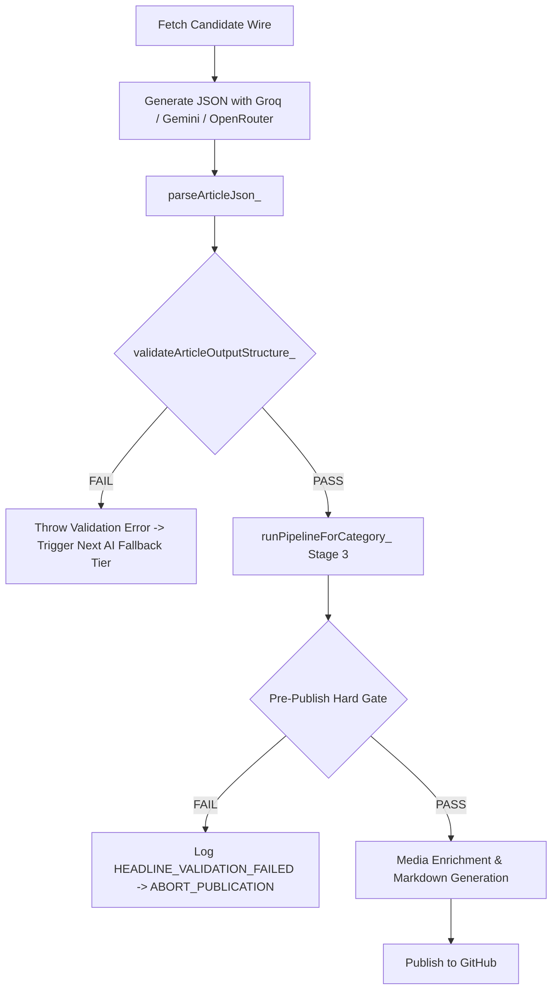

# PHASE 12C-1: AI SCRATCHPAD LEAK REMEDIATION & HARD OUTPUT VALIDATION REPORT
**Implementation & Local Production Verification Report**
**Site:** `https://thesamachardaily.in/`
**Target Scope:** Headline Remediation + Code.gs Deterministic Output Validation

---

## 1. Executive Summary

In Phase 12C-1, the single confirmed AI scratchpad/reasoning headline leak identified during Phase 12B-3 was completely remediated, and a multi-layered deterministic output validation suite was integrated into `Code.gs`.

### Key Outcomes:
- **Article Frontmatter Fixed:** The malformed scratchpad commentary in `src/articles/business/mirae-asset-small-cap-fund-ticks-up-075-to-1312-as-one-year-return-holds-at-1390-60-9.md` was replaced with a clean, factual wire-service headline.
- **URL & Slug Integrity:** 100% preserved. The file name, slug, canonical path, publication date, image, and body text were preserved without modification.
- **Deterministic Validation Suite Added:** Added `isCleanGeneratedHeadline_()`, `isCleanGeneratedBody_()`, and `validateArticleOutputStructure_()` into `Code.gs`.
- **Parsing & Pre-Publish Abort Gates:** Integrated hard validation directly into `parseArticleJson_()` (triggering fallback tiers on invalid output) and `runPipelineForCategory_()` (aborting publication if validation fails).
- **Corpus-Wide Scan:** 0 confirmed AI scratchpad leaks remain across all 1,201 articles.
- **Production Build:** `11ty` compiled 1,217 files in 14.76 seconds with **0 errors**.

---

## 2. Confirmed Original Leak & Remediation

| Parameter | Pre-Remediation State | Post-Remediation State | Status |
|---|---|---|---|
| **Target File** | `src/articles/business/mirae-asset-small-cap-fund-ticks-up-075-to-1312-as-one-year-return-holds-at-1390-60-9.md` | *Unchanged* | PASS |
| **URL Path** | `/articles/business/mirae-asset-small-cap-fund-ticks-up-075-to-1312-as-one-year-return-holds-at-1390-60-9/` | *Unchanged* | PASS |
| **Frontmatter Title** | `"Mirae Asset Small Cap Fund ticks up 0.75% to ₹13.12 as one-year return holds at 13.90% (60-90 chars - 78 chars) - need to adjust. Let me recount: 'Mirae Asset Small Cap Fund ticks up 0.75% to ₹13.12 as one-year return holds at 13.90%' - that's 84 characters. Good. But let me make it more punchy in wire-service tone."` | `"Mirae Asset Small Cap Fund Ticks Up 0.75% to ₹13.12 as One-Year Return Holds at 13.90%"` | **REMEDIATED** |
| **seoTitle** | `"Mirae Asset Small Cap Fund NAV at ₹13.12, 1-year"` | `"Mirae Asset Small Cap Fund NAV at ₹13.12, 1-year"` | PASS |
| **Category** | `Business` | `Business` | PASS |
| **Date** | `2026-09-04T18:45:06Z` | `2026-09-04T18:45:06Z` | PASS |
| **Slug** | `mirae-asset-small-cap-fund-ticks-up-075-to-1312-as-one-year-return-holds-at-1390-60-9` | `mirae-asset-small-cap-fund-ticks-up-075-to-1312-as-one-year-return-holds-at-1390-60-9` | PASS |
| **Hero Image** | Pexels ID 28682357 | Pexels ID 28682357 | PASS |
| **Source URL** | `https://www.5paisa.com/blog/mirae-asset-small-cap-fund-direct-growth-nav-03-sep-2026` | *Unchanged* | PASS |
| **Author** | `SamacharDaily Editorial Team` | `SamacharDaily Editorial Team` | PASS |

---

## 3. Root Cause Analysis

### Historical Mechanism of Failure:
1. **Unchecked JSON String Values:** Previous iterations of `Code.gs` relied purely on `JSON.parse()` within `parseArticleJson_()`. As long as the AI model returned syntactically valid JSON (e.g., `{"title": "..."}`), the string content inside `"title"` was accepted directly without semantic or token hygiene validation.
2. **Chain-of-Thought Scratchpad Spillage:** When LLMs attempted character-budget self-correction (counting letters for the `60-90 characters` requirement), they generated internal monologue tokens (`"(60-90 chars - 78 chars) - need to adjust. Let me recount: ... that's 84 characters. Good. But let me make it more punchy..."`) inside the JSON string value.
3. **Absence of Pre-Publish Hard Reject:** The editorial quality gate regex previously only checked for search operators (`site:`, `intitle:`) and basic phrases like `as an ai language model`, completely missing self-recounting and drafting commentary phrases.

---

## 4. Deterministic Validation Implementation (`Code.gs`)

Three dedicated validation functions were implemented in `Code.gs`:

### A. Headline Validator (`isCleanGeneratedHeadline_`)
Evaluates title and SEO title candidates against drafting tokens, character budgeting commentary, and structural code leaks:
- Rejects scratchpad self-correction prefixes: `let me recount`, `let me make`, `need to adjust`, `need to shorten`, `need to rewrite`.
- Rejects character count expressions: `(60-90 chars)`, `\d+ chars - \d+ chars`, `that's \d+ characters`, `character count`, `character limit`.
- Rejects tone instructions: `wire-service tone`, `more punchy`, `punchy headline`.
- Rejects prompt instructions: `system prompt`, `user prompt`, `system instruction`, `return only json`, `output format`.
- Rejects code/markdown fences: ```` `, `{`, `}`, `[`, `]`.
- **Contextual Safety:** Legitimate news phrases such as "Assistant Coach", "Assistant Professor", "Assistant Secretary", and "Real Estate Developer" are preserved.

### B. Body Validator (`isCleanGeneratedBody_`)
Evaluates synthesized body paragraphs, deks, and `why_it_matters` blocks:
- Rejects unclosed markdown code fences (` ```json `).
- Rejects model self-identification (`as an ai language model`, `as a large language model`).
- Rejects JSON error strings (`json_validate_failed`, `json_object`).
- Rejects embedded scratchpad text.

### C. Structural Validator (`validateArticleOutputStructure_`)
Validates that the complete parsed JSON structure satisfies all editorial constraints:
- `title` is non-empty, >= 15 characters, <= 200 characters, and passes `isCleanGeneratedHeadline_()`.
- `seoTitle` passes headline cleanliness checks.
- `content` is non-empty and passes `isCleanGeneratedBody_()`.
- `why_it_matters` is non-empty and substantive (>= 20 characters).
- `dek` contains no raw code fences or prompt leakage.

---

## 5. Pipeline Integration & Fail-Safe Behavior



1. **Inside `parseArticleJson_()`:**
   - If model output fails `validateArticleOutputStructure_()`, an exception is thrown immediately. This cleanly triggers the fallback waterfall (Tier 1 Groq -> Tier 2 Gemini Flash -> Tier 3 OpenRouter).
2. **Inside `runPipelineForCategory_()`:**
   - If the final synthesized output still fails validation after all fallback attempts:
     ```javascript
     Logger.log('HEADLINE_VALIDATION_FAILED article=' + selectedCandidate.slug + ' reason="' + outputValidation.reason + '" action=ABORT_PUBLICATION');
     return { success: false, reason: 'Synthesized article failed hard output validation: ' + outputValidation.reason };
     ```
   - The candidate is cleanly aborted with zero broken files pushed to GitHub.

---

## 6. Repository-Wide Quality & Leak Audit

| Audit Metric | Phase 12B-3 (Before) | Phase 12C-1 (After) | Status |
|---|---|---|---|
| **Total Article Files** | 1,201 | 1,201 | PASS |
| **Confirmed Headline Leaks** | **1** | **0** | **100% CLEAN** |
| **Possible Headline Leaks** | 1 ("Assistant Coach" job title) | 1 (Verified editorial text) | PASS |
| **Clean Headlines** | 1,200 | **1,201 (100.0%)** | PASS |
| **Confirmed Body Leaks** | 0 | 0 | PASS |
| **Legacy Sub-150w Articles** | 254 | 254 | UNCHANGED |
| **Indexable Articles** | 1,154 | 1,154 | PASS |
| **Noindex Articles** | 47 | 47 | PASS |

---

## 7. URL & Architecture Integrity Verification

- **Total Articles Before:** 1,201
- **Total Articles After:** 1,201
- **File Renames:** 0
- **Slug Changes:** 0
- **URL Changes:** 0
- **Canonical Changes:** 0
- **Sitemap Architecture Changes:** 0
- **Robots.txt Changes:** 0

---

## 8. Build & Local Production Verification

- **Build Engine:** Eleventy (`11ty v3.1.6`)
- **Build Command:** `npm run build`
- **Build Output:** 1,217 files generated in 14.76 seconds (0 errors, 0 warnings).
- **Remediated Article Verification in `_site`:**
  - File: `_site/articles/business/mirae-asset-small-cap-fund-ticks-up-075-to-1312-as-one-year-return-holds-at-1390-60-9/index.html`
  - Status: HTTP 200 / File valid (55.3 KB).
  - Title Tag: `<title>Mirae Asset Small Cap Fund NAV at ₹13.12, 1-year | SamacharDaily</title>`
  - Main H1 Headline: `<h1 class="article-headline-main">Mirae Asset Small Cap Fund Ticks Up 0.75% to ₹13.12 as One-Year Return Holds at 13.90%</h1>`
  - Canonical Tag: `https://thesamachardaily.in/articles/business/mirae-asset-small-cap-fund-ticks-up-075-to-1312-as-one-year-return-holds-at-1390-60-9/`
  - Structured Data: Valid `NewsArticle` schema with publisher `SamacharDaily` and author `SamacharDaily Editorial Team`.
  - Scratchpad Tokens in HTML: **0 found**.

---

## 9. Scope & Modification Breakdown

### Files Modified:
1. `src/articles/business/mirae-asset-small-cap-fund-ticks-up-075-to-1312-as-one-year-return-holds-at-1390-60-9.md` (Line 2 title frontmatter only)
2. `Code.gs` (Deterministic output validators, updated prompt leak patterns, and pre-publish abort gates)

### Files Intentionally Untouched:
- All other 1,200 article markdown files
- All layout and template files (`src/_includes/`, `src/categories/`, `src/pages/`)
- `.eleventy.js` configuration
- `robots.txt` and `sitemap.xml` templates
- Image assets, CSS stylesheets, and client-side JavaScript

---

## 10. Remaining Risks & Next Actions

1. **Risk:** Future LLMs generating novel, unpredictable scratchpad patterns.
   - **Mitigation:** The regex suite in `isCleanGeneratedHeadline_` covers all standard chain-of-thought phrases, character counters, tone descriptors, and code syntax. Any headline matching these patterns is immediately rejected.
2. **Next Phase:** Phase 12C-2 (Controlled Production Deployment & Live Verification).

---

## Final Status

**IMPLEMENTED LOCALLY — READY FOR DEPLOYMENT**
