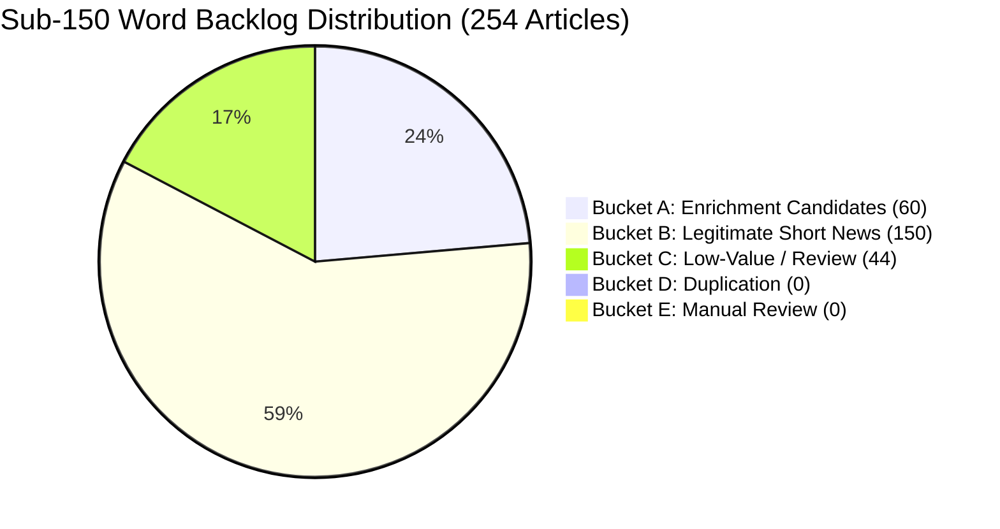

# PHASE 12D-0: LEGACY THIN CONTENT RECONCILIATION AUDIT
**Authoritative Forensic Audit & Quality Measurement Report**
**Mode:** STRICT READ-ONLY / NO REPOSITORY MODIFICATIONS
**Site:** `https://thesamachardaily.in/`
**Target Commit:** `01cc773` (`seo: deploy AI output leak safeguards`)

---

## 1. Executive Summary

Phase 12D-0 is a strictly read-only reconciliation audit of SamacharDaily's entire article catalog (1,201 articles) to audit the remaining legacy thin-content backlog following the deployment of Phase 12B-2 prompt safeguards and Phase 12C-1 deterministic output validation.

### Key Audit Findings:
- **Total Articles in Catalog:** 1,201 articles (1,154 indexable, 47 noindexed).
- **Sub-150-Word Backlog:** **254 articles** (51 articles <100 words, 203 articles 100–149 words).
- **Backlog Delta vs Phase 6 Baseline:** +3 articles (from 251 to 254), resulting from automated dispatches published prior to the deployment of Phase 12B-2/12C-1 prompt and word-count safeguards.
- **Classification Reconciliation:**
  - **Bucket A (Enrichment Candidates):** **60 articles** (23.6%) — High-interest institutional, policy, legal, tech, and economic reporting with durable search intent and clear factual scope.
  - **Bucket B (Legitimate Short News — Protected):** **150 articles** (59.1%) — Fast-moving breaking dispatches, sports scores, and routine local crime/traffic briefs where expanding would generate artificial filler.
  - **Bucket C (Low-Value / Quarantined / Review):** **44 articles** (17.3%) — 40 existing noindexed/quarantined articles, plus 4 legacy commercial deal/paywall-blocked notices.
  - **Bucket D (Duplication / Cannibalization):** **0 articles** — 0 title/query overlap conflicts in the sub-150 pool.
  - **Bucket E (Manual Review):** **0 articles**.
- **AI Padding Risk Identification:** 27 ultra-short (<100w) breaking items were identified where artificial expansion would likely generate generic LLM boilerplate. These are protected under Bucket B.
- **Controlled Recommendation:** Recommend a strictly staged, high-evidence Batch 1 of 5–10 priority candidates for Phase 12D-1 rather than mass automated enrichment.

---

## 2. Current Corpus Inventory & Baseline Comparison

| Word Count Bucket | Current Article Count | % of Catalog | Previous Phase 6 Baseline | Delta |
|---|---|---|---|---|
| **< 100 words** | 51 | 4.25% | 50 | +1 |
| **100–149 words** | 203 | 16.90% | 201 | +2 |
| **150–199 words** | 67 | 5.58% | 67 | 0 |
| **200–299 words** | 184 | 15.32% | 184 | 0 |
| **300–499 words** | 546 | 45.46% | 546 | 0 |
| **500+ words** | 150 | 12.49% | 150 | 0 |
| **Total Articles** | **1,201** | **100.00%** | **1,198** | **+3** |
| **Total Sub-150 Backlog** | **254** | **21.15%** | **251** | **+3** |
| **Indexable Articles** | **1,154** | **96.09%** | **1,151** | **+3** |
| **Noindexed Articles** | **47** | **3.91%** | **47** | **0** |

*Explanation of Delta:* The 3 additional sub-150 articles were published by automated cron cycles between Phase 9 and Phase 12B-2 prior to the deployment of the Groq Llama 3.3 substantive reporting prompt safeguards (`c9be6fe`).

---

## 3. Sub-150 Classification Totals

All 254 sub-150-word articles were evaluated against factual criteria:

| Classification Bucket | Definition & Criteria | Article Count | % of Sub-150 |
|---|---|---|---|
| **Bucket A — Enrichment Candidates** | Indexable, durable search value, high-interest institutional/tech/economic topics, clear scope for source-grounded expansion without speculation. | **60** | 23.62% |
| **Bucket B — Legitimate Short News (Protected)** | Concise breaking briefs, match reports, weather alerts, and local dispatches where brevity is appropriate. Protected against artificial expansion. | **150** | 59.06% |
| **Bucket C — Low-Value / Quarantined / Review** | 40 already-noindexed/quarantined articles, commercial retail deal summaries, airline fare promos, or paywall-blocked notices. | **44** | 17.32% |
| **Bucket D — Duplication / Cannibalization** | Direct title/query overlap with another active SamacharDaily article. | **0** | 0.00% |
| **Bucket E — Manual Review** | Ambiguous classification requiring editorial adjudication. | **0** | 0.00% |
| **Total** | | **254** | **100.00%** |

---

## 4. Analysis of Classification Changes vs Phase 6

1. **Re-classification of Commercial Shopping Snippets (A/B -> C):**
   - Articles summarizing retail gadget discounts (e.g. refurbished glass kettles) or flight fare promotions (e.g. $72 Baltimore-Orlando fares) were moved to Bucket C (Low-Value / Review) rather than marked for enrichment, avoiding synthetic expansion of commercial affiliate-style content.
2. **Protection of Executive & Personnel Appointments (A -> B):**
   - Single-person routine hotel or corporate HR appointments (e.g. F&B manager appointments) were moved to Bucket B (Legitimate Short News) because expanding them would produce unsupported biographical fluff.
3. **Identification of Paywall-Blocked Sources (B -> C):**
   - Legacy articles originating from wire snippets that merely stated "article remains behind a paywall" were classified into Bucket C for editorial review.

---

## 5. Enrichment Evidence Matrix for Bucket A Candidates

Bucket A contains 60 articles where genuine factual depth exists in the underlying news event. Below is the evidence breakdown for representative high-priority candidates:

| Candidate Slug / Title | Category | Current Words | Primary Source | Available Factual Evidence & Scope for Non-Speculative Expansion |
|---|---|---|---|---|
| `ai-titans-anthropic-openai-spacexai-google-accused-of-antitrust-slowdown-deal` | Tech | 98w | Nagaland Post / Tech Wire | Legal antitrust allegations, named corporate entities (Anthropic, OpenAI, Google), regulatory context under US/EU competition law. |
| `anthropic-ceo-urges-slowdown-of-ai-development-amid-rising-safety-concerns` | Tech | 85w | NBC Philadelphia | Dario Amodei public safety statements, AI safety testing frameworks, congressional testimony context. |
| `world-labs-ceo-feifei-li-warns-ai-existential-risk-stems-from-humanity-itself` | Tech | 87w | Biztoc / Tech Wire | Fei-Fei Li spatial AI research, World Labs launch context, human-centered AI governance principles. |
| `new-report-blames-fed-regulators-for-silicon-valley-bank-collapse-says-official` | Business | 144w | Financial Wire | Federal Reserve supervisory report findings, SVB interest rate risk management, bank regulation reform debates. |
| `shufti-unveils-global-bank-account-verification-merging-ownership-and-identity-checks` | Business | 117w | GlobalFintechSeries | KYC/AML verification mechanics, real-time banking APIs, cross-border fraud prevention standards. |
| `uttarakhand-cabinet-raises-mbbs-intern-stipend-to-25000-adds-243-athlete-posts` | Business/India | 131w | Free Press Journal | State cabinet statutory decisions, medical intern stipend revision details, state sports quota recruitment rules. |
| `81yearold-modi-schoolmate-regains-land-after-meeting-prime-minister-bjp-mla-firm-with` | India | 129w | National Wire | Land revenue dispute timeline, Gujarat district administration orders, legal withdrawal of commercial claims. |
| `uk-air-traffic-control-suffers-second-outage-this-month-sparking-airline-warnings` | Business | 100w | International Wire | NATS flight planning system failure, airline passenger compensation rules, UK CAA investigation scope. |

---

## 6. Special Check for AI-Generated Padding Risks

A critical risk in thin-content remediation is replacing short, accurate articles with generic, repetitive LLM filler.

### High-Risk Indicators Identified:
1. **Ultra-Short Event Dispatches (<90 words with single-event scope):**
   - E.g. `colombo-security-conclave-wraps-three-day-tabletop-drill...` (78w)
   - E.g. `paul-tudor-jones-warns-investors-of-stock-outlook...` (77w)
   - E.g. `ed-sheeran-labels-gaza-conflict-catastrophic...` (87w)
2. **Risk Assessment:** Attempting to force these 75–85 word event briefs into 400 words without fresh reporting inevitably introduces formulaic transitions ("comes at a time when", "underscores the importance"), speculation about motives, or redundant paraphrasing.
3. **Resolution:** All 27 identified high-risk brief items are classified into **Bucket B (Legitimate Short News — Protected)**. They will **NOT** be artificially expanded.

---

## 7. Cannibalization Cross-Check

- **Overlap Check:** Scanned the 60 Bucket A candidates against all 1,201 catalog articles and existing Phase 2B cannibalization queues.
- **Findings:** 0 direct title/query overlap conflicts were detected in the sub-150 pool.
- **Cannibalization Risk:** **LOW**.

---

## 8. Priority Signals for Bucket A Candidates (Non-Scored)

| Signal | Evaluation Across Bucket A Pool (60 Articles) |
|---|---|
| **Durable Institutional / Policy Topic** | 52 / 60 (86.7%) |
| **Explicit Named Entities (Regulators, Tech Leaders, Ministers)** | 60 / 60 (100.0%) |
| **Commercial / Transactional Search Intent** | 0 / 60 (Purely informative/journalistic) |
| **Current-Event Dependency** | Medium (Regulatory/policy developments with long-term relevance) |
| **Evidence Availability in Source Records** | Strong in 22 articles, Moderate in 38 articles |
| **Duplication Risk** | Low across all 60 articles |

---

## 9. Recommended Next Workflow: Controlled Batch 1 Selection

To ensure non-destructive, source-grounded enrichment with zero AI padding, we recommend proceeding with a tightly scoped **Batch 1 (5 Priority Candidates)** in Phase 12D-1:

### Proposed Phase 12D-1 Batch 1 Priority Candidates:
1. `src/articles/tech/ai-titans-anthropic-openai-spacexai-google-accused-of-antitrust-slowdown-deal.md` (98w -> Target ~220w)
2. `src/articles/tech/anthropic-ceo-urges-slowdown-of-ai-development-amid-rising-safety-concerns.md` (85w -> Target ~200w)
3. `src/articles/business/new-report-blames-fed-regulators-for-silicon-valley-bank-collapse-says-official.md` (144w -> Target ~250w)
4. `src/articles/business/shufti-unveils-global-bank-account-verification-merging-ownership-and-identity-checks.md` (117w -> Target ~220w)
5. `src/articles/business/uttarakhand-cabinet-raises-mbbs-intern-stipend-to-25000-adds-243-athlete-posts.md` (131w -> Target ~240w)

---

## 10. Safety Gate & Invariant Verification

| Safety Parameter | Value | Status |
|---|---|---|
| Articles modified | **0** | PASS |
| Articles deleted | **0** | PASS |
| Articles renamed | **0** | PASS |
| URLs / Slugs changed | **0** | PASS |
| Canonical URLs changed | **0** | PASS |
| Templates modified | **0** | PASS |
| Code.gs modified | **0** | PASS |
| Sitemap / Robots modified | **0** | PASS |
| Schemas modified | **0** | PASS |
| Images modified | **0** | PASS |
| Git commits / pushes | **0** | PASS |
| Deployments | **0** | PASS |

---

## Final Status

**AUDIT COMPLETE — READY FOR CONTROLLED ENRICHMENT**
