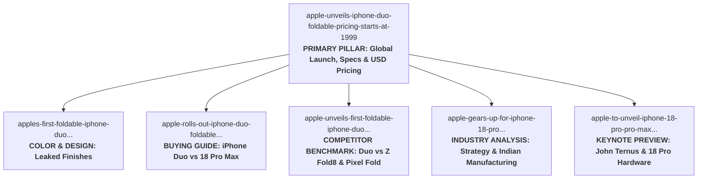

# SAMACHAR DAILY — SEO REHABILITATION
# PHASE 2B-2C: APPLE FOLDABLE / IPHONE DUO DEEP INTENT AUDIT

**Target Domain:** `https://thesamachardaily.in/`  
**Repository:** `strngx/samachardaily` (`main` branch)  
**Status:** READ-ONLY DEEP INTENT AUDIT — ZERO REPOSITORY CHANGES  

---

## 1. EXECUTIVE OVERVIEW & CONTEXT

The Phase 2A and Phase 2B-2A audits identified a high-density cluster of **6 Markdown articles** published between September 5 and September 20, 2026, all addressing Apple's entry into the foldable smartphone segment (the "iPhone Duo" / "iPhone Ultra") and the concurrent iPhone 18 Pro series launch.

This deep audit evaluates whether these 6 URLs represent:
1. Genuinely distinct search intents that can be permanently differentiated;
2. Successive chronological updates to a fast-moving breaking news cycle; or
3. Near-duplicate content candidates for potential future consolidation once Google Search Console performance data becomes available.

---

## 2. SIX-ARTICLE CHRONOLOGICAL TIMELINE

| # | Pub Date & Time (UTC) | File / Slug | Word Count | Status / Stage | Primary Subject Focus |
| :-: | :--- | :--- | :-: | :--- | :--- |
| **1** | **2026-09-05 16:47** | `apple-gears-up-for-iphone-18-pro-lineup-and-first-foldable-iphone-launch-on-september` | 350 | **EXPECTED / ANALYSIS** | Strategic pre-launch analysis, market timing, Indian manufacturing impact. |
| **2** | **2026-09-09 18:19** | `apple-to-unveil-iphone-18-pro-pro-max-and-first-foldable-iphone-ultra-at-tonights-sur` | 269 | **EXPECTED / PREVIEW** | "Surprise & Shine" event livestream guide, CEO John Ternus keynote, iPhone 18 Pro camera/chip specs. |
| **3** | **2026-09-10 04:56** | `apples-first-foldable-iphone-duo-set-for-tonights-launch-with-leaked-color-lineup-and` | 246 | **LEAKED / RUMORED** | Pre-event color palette leak (Midnight Black, Silver Frost, Rose Gold), INR ₹1.4L price rumor. |
| **4** | **2026-09-10 10:56** | `apple-unveils-iphone-duo-foldable-pricing-starts-at-1999` | 266 | **CONFIRMED / PILLAR** | Official launch, 7.5" display, 3-tier USD pricing ($1,999–$3,199), Oct 16 pre-orders, Oct 23 shipping. |
| **5** | **2026-09-12 18:45** | `apple-rolls-out-iphone-duo-foldable-and-iphone-18-pro-max-prices-revealed` | 76 | **CONFIRMED / COMPARISON** | Price and screen comparison: iPhone Duo (₹2,99,900, 7.6") vs. iPhone 18 Pro Max (₹1,79,900, 6.9"). |
| **6** | **2026-09-20 05:24** | `apple-unveils-first-foldable-iphone-duo-targets-october-launch-amid-pro-lineup-reveal` | 68 | **REPORTED / BENCHMARK** | NDTV Kaiann Drance video review comparing iPhone Duo vs. Samsung Galaxy Z Fold8 & Google Pixel 11 Pro Fold. |

---

## 3. ARTICLE-BY-ARTICLE DEEP ANALYSIS

---

### Article 1 (Chronological #4): Official Product Announcement (Pillar)
* **Filepath:** `src/articles/tech/apple-unveils-iphone-duo-foldable-pricing-starts-at-1999.md`
* **URL:** `https://thesamachardaily.in/articles/tech/apple-unveils-iphone-duo-foldable-pricing-starts-at-1999/`
* **Title:** `Apple Unveils iPhone Duo Foldable, Pricing Starts at $1,999`
* **Description (dek):** `Apple announced the iPhone Duo, its first foldable phone, with a passport-sized folded form, 7.5‑inch unfolded screen, storage from 256 GB to 2 TB, and pricing from $1,999 to $3,199, shipping on Oct 23.`
* **Publication Date:** 2026-09-10T10:56:58Z | **Category:** Tech | **Word Count:** 266
* **Primary Entities:** Apple, iPhone Duo, iOS 18, A-series processor, MagSafe, Samsung, Huawei, Motorola.
* **Main Event:** Official post-briefing hardware announcement and full spec release.
* **Article Purpose:** Authoritative news overview of Apple’s foldable hardware launch.
* **Unique Factual Information:**
  * Exact 3-tier USD pricing: 256 GB ($1,999), 512 GB ($2,399), 2 TB ($3,199).
  * Exact sales calendar: Pre-orders on October 16, retail shipping on October 23.
  * Exact battery test figure: Up to 12 hours of mixed-use video playback.
  * Form factor details: Passport-sized folded footprint expanding to a 7.5-inch inner display.
* **Overlapping Information:** Mentions general foldable competition from Samsung/Huawei.
* **Apparent Search Intent:** `Apple iPhone Duo price specs launch date` (Commercial & Informational)
* **Evergreen vs Event-Specific:** Evergreen Reference Pillar.
* **Distinct Reason to Exist:** **YES — DEFINITIVE PRIMARY TOPIC PILLAR.**

---

### Article 2 (Chronological #3): Color Palette & Design Finishes Leak
* **Filepath:** `src/articles/tech/apples-first-foldable-iphone-duo-set-for-tonights-launch-with-leaked-color-lineup-and.md`
* **URL:** `https://thesamachardaily.in/articles/tech/apples-first-foldable-iphone-duo-set-for-tonights-launch-with-leaked-color-lineup-and/`
* **Title:** `Apple’s First Foldable iPhone Duo Set for Tonight’s Launch with Leaked Color Lineup and Pricing`
* **Description (dek):** `Apple will unveil its first foldable iPhone Duo at 10:30 PM IST today, with leaked color options, a starting price, 256 GB storage and an October sale date confirmed.`
* **Publication Date:** 2026-09-10T04:56:57Z | **Category:** Tech | **Word Count:** 246
* **Primary Entities:** Apple, iPhone Duo, Sunday Guardian, Surprise & Shine event.
* **Main Event:** Pre-event leak detailing the visual color palette and early Indian retail price expectation.
* **Article Purpose:** Reports on leaked finishes hours before the official reveal.
* **Unique Factual Information:**
  * Color finishes: Midnight Black, Silver Frost, and Rose Gold.
  * Speculative pre-event Indian base price estimate (₹1,39,999 for 256GB).
* **Overlapping Information:** Pre-event launch schedule and generic foldable display expectations.
* **Apparent Search Intent:** `iPhone Duo colors leaked finishes Rose Gold Silver Frost Midnight Black`
* **Evergreen vs Event-Specific:** Event-specific / Pre-launch leak (high obsolescence risk once officially revealed).
* **Distinct Reason to Exist:** **PARTIAL — Valid solely if focused strictly on aesthetic color options and design finishes.**

---

### Article 3 (Chronological #5): Duo vs. iPhone 18 Pro Max Price & Display Comparison
* **Filepath:** `src/articles/tech/apple-rolls-out-iphone-duo-foldable-and-iphone-18-pro-max-prices-revealed.md`
* **URL:** `https://thesamachardaily.in/articles/tech/apple-rolls-out-iphone-duo-foldable-and-iphone-18-pro-max-prices-revealed/`
* **Title:** `Apple Rolls Out iPhone Duo Foldable and iPhone 18 Pro Max, Prices Revealed`
* **Description (dek):** `Apple's new iPhone Duo foldable starts at INR 2,99,900, while the iPhone 18 Pro Max begins at INR 1,79,900, both powered by the A20 Pro chip and Apple Intelligence.`
* **Publication Date:** 2026-09-12T18:45:15Z | **Category:** Tech | **Word Count:** 76
* **Primary Entities:** Apple, iPhone Duo, iPhone 18 Pro Max, A20 Pro, Apple Intelligence.
* **Main Event:** Post-launch pricing and display size contrast between top flagship models.
* **Article Purpose:** Direct head-to-head comparison between foldable and standard flagship.
* **Unique Factual Information:**
  * Direct price delta in INR: Duo (₹2,99,900) vs. 18 Pro Max (₹1,79,900) — ₹1.2 lakh difference.
  * Direct display size contrast: 7.6-inch foldable vs. 6.9-inch conventional screen.
  * Shared architecture: Both utilizing the A20 Pro chip and Apple Intelligence.
* **Overlapping Information:** Product naming and general launch timing.
* **Apparent Search Intent:** `iPhone Duo vs iPhone 18 Pro Max price comparison India specs`
* **Evergreen vs Event-Specific:** Evergreen Commercial Comparison.
* **Distinct Reason to Exist:** **YES — Clear commercial comparison intent (needs editorial expansion during thin-content phase).**

---

### Article 4 (Chronological #6): Video Hands-On & Android Foldable Competitor Benchmark
* **Filepath:** `src/articles/tech/apple-unveils-first-foldable-iphone-duo-targets-october-launch-amid-pro-lineup-reveal.md`
* **URL:** `https://thesamachardaily.in/articles/tech/apple-unveils-first-foldable-iphone-duo-targets-october-launch-amid-pro-lineup-reveal/`
* **Title:** `Apple Unveils First Foldable iPhone Duo, Targets October Launch Amid Pro Lineup Reveal`
* **Description (dek):** `Apple’s first foldable iPhone Duo, previewed in a Kaiann Drance NDTV video alongside iPhone 18 Pro plans, is set for an October launch; the content is behind a paid‑plan wall.`
* **Publication Date:** 2026-09-20T05:24:08Z | **Category:** Tech | **Word Count:** 68
* **Primary Entities:** Kaiann Drance, NDTV, iPhone Duo, Samsung Galaxy Z Fold8, Google Pixel 11 Pro Fold.
* **Main Event:** Broadcast television executive interview and hands-on hardware comparison.
* **Article Purpose:** Reports on NDTV's video exclusive benchmarking the Duo against Android rivals.
* **Unique Factual Information:**
  * First media hands-on comparison with Samsung Galaxy Z Fold8 and Google Pixel 11 Pro Fold.
  * Kaiann Drance (Apple VP of iPhone Product Marketing) interview statements.
* **Overlapping Information:** October release timeline and Pro lineup mention.
* **Apparent Search Intent:** `iPhone Duo vs Galaxy Z Fold8 Pixel 11 Pro Fold video review Kaiann Drance`
* **Evergreen vs Event-Specific:** Long-tail review/comparison query.
* **Distinct Reason to Exist:** **PARTIAL — Distinct competitor comparison angle, but severely thin (68 words) due to paywalled source.**

---

### Article 5 (Chronological #1): Macroeconomic Strategy & Industry Impact Analysis
* **Filepath:** `src/articles/tech/apple-gears-up-for-iphone-18-pro-lineup-and-first-foldable-iphone-launch-on-september.md`
* **URL:** `https://thesamachardaily.in/articles/tech/apple-gears-up-for-iphone-18-pro-lineup-and-first-foldable-iphone-launch-on-september/`
* **Title:** `Apple Gears Up for iPhone 18 Pro Lineup and First Foldable iPhone Launch on September 9`
* **Description (dek):** `Apple is preparing to unveil the iPhone 18 Pro, iPhone 18 Pro Max, and its first foldable iPhone variant on September 9, with features and pricing details beginning to surface.`
* **Publication Date:** 2026-09-05T16:47:57Z | **Category:** Tech | **Word Count:** 350
* **Primary Entities:** Apple, iPhone 18 Pro, iPhone 18 Pro Max, Indian Manufacturing, Supply Chain.
* **Main Event:** Pre-event industry analysis of Apple's strategic expansion into foldables.
* **Article Purpose:** Strategic analysis of why Apple is entering foldables and its Indian industrial footprint.
* **Unique Factual Information:**
  * In-depth analysis of Apple's packaging strategy (bundling the foldable with the Pro series).
  * Impact on Indian manufacturing footprint and premium retail expansion.
  * Analysis of high-end price ceiling setting new benchmark for global supply chain.
* **Overlapping Information:** General event date (September 9) and device model names.
* **Apparent Search Intent:** `Apple foldable strategy smartphone industry impact Indian manufacturing`
* **Evergreen vs Event-Specific:** Evergreen Industry Analysis.
* **Distinct Reason to Exist:** **YES — Most comprehensive editorial piece (350 words) with distinct analytical angle.**

---

### Article 6 (Chronological #2): Keynote Livestream Guide & iPhone 18 Pro Hardware Preview
* **Filepath:** `src/articles/tech/apple-to-unveil-iphone-18-pro-pro-max-and-first-foldable-iphone-ultra-at-tonights-sur.md`
* **URL:** `https://thesamachardaily.in/articles/tech/apple-to-unveil-iphone-18-pro-pro-max-and-first-foldable-iphone-ultra-at-tonights-sur.md`
* **Title:** `Apple to unveil iPhone 18 Pro, Pro Max and first foldable iPhone Ultra at tonight’s “Surprise and Shine” event`
* **Description (dek):** `Apple’s “Surprise and Shine” event starts at 10:30 PM IST on September 9, 2026, with CEO John Ternus set to unveil the iPhone 18 Pro, iPhone 18 Pro Max and the foldable iPhone Ultra (iPhone Duo).`
* **Publication Date:** 2026-09-09T18:19:27Z | **Category:** Tech | **Word Count:** 269
* **Primary Entities:** John Ternus, Tim Cook, Apple TV app, A20 Pro chip, Surprise and Shine event.
* **Main Event:** Event night keynote streaming guide and executive leadership transition.
* **Article Purpose:** Guides viewers on where/when to watch and previews John Ternus's inaugural keynote.
* **Unique Factual Information:**
  * John Ternus taking over as CEO following Tim Cook's retirement and leading the keynote.
  * Exact streaming distribution channels: Apple.com, Apple TV app, YouTube.
  * Specific iPhone 18 Pro hardware expectations: variable-aperture camera system, titanium chassis.
* **Overlapping Information:** 10:30 PM IST start time and foldable moniker speculation ("iPhone Ultra").
* **Apparent Search Intent:** `How to watch Apple Surprise and Shine event John Ternus keynote iPhone 18 Pro livestream`
* **Evergreen vs Event-Specific:** Event-specific (Livestream guide) with historical interest (Ternus CEO transition).
* **Distinct Reason to Exist:** **YES — Differentiated around John Ternus CEO keynote and iPhone 18 Pro hardware specs.**

---

## 4. INTENT MATRIX & UNIQUE VALUE SUMMARY

| Article (#) | Primary Search Intent | Unique Factual Value | Overlap Areas | Recommendation |
| :--- | :--- | :--- | :--- | :--- |
| **Article 1** (`apple-unveils-iphone-duo...`) | **Official Product Launch & Full Specs** | 3-tier USD pricing ($1.9k–$3.1k), Oct 16/23 dates, 12h battery | None (Primary Source) | **PRIMARY CANDIDATE (KEEP SEPARATE / PILLAR)** |
| **Article 2** (`apples-first-foldable...`) | **Leaked Color Palette & Finishes** | Midnight Black, Silver Frost, Rose Gold palette | Event timing, general rumors | **DIFFERENTIATE (Title: Color Options & Aesthetics)** |
| **Article 3** (`apple-rolls-out-iphone-duo...`) | **Duo vs. 18 Pro Max Comparison** | ₹2.99L vs ₹1.79L INR price gap, 7.6" vs 6.9" display | Brand names, A20 chip | **DIFFERENTIATE (Title: Head-to-Head Comparison)** |
| **Article 4** (`apple-unveils-first-foldable...`) | **Hands-On vs Android Foldables** | NDTV Kaiann Drance segment vs Z Fold8 & Pixel 11 Pro Fold | October launch date | **DIFFERENTIATE (Title: Android Foldable Benchmark)** |
| **Article 5** (`apple-gears-up-for-iphone-18...`) | **Macro Strategy & Indian Manufacturing** | Supply chain pricing ceiling, India manufacturing growth | September 9 event date | **DIFFERENTIATE (Title: Strategic Industry Analysis)** |
| **Article 6** (`apple-to-unveil-iphone-18-pro...`) | **John Ternus Keynote & Pro Specs** | John Ternus CEO keynote, stream links, variable aperture | Event date, Duo rumors | **DIFFERENTIATE (Title: Keynote Stream & Pro Specs)** |

---

## 5. PAIR / CLUSTER RELATIONSHIPS & OVERLAP ANALYSIS

Among the 15 pair relationships across these 6 articles:

1. **Article 1 vs Article 2 (Launch Pillar vs Color Leak):**
   * *Relationship:* POTENTIAL CANNIBALIZATION.
   * *Resolution:* Article 1 covers confirmed global pricing/specs; Article 2 covers pre-launch aesthetic finishes. Differentiating Article 2's title to focus strictly on color finishes removes search intent conflict.
2. **Article 1 vs Article 3 (Launch Pillar vs Pro Max Comparison):**
   * *Relationship:* POTENTIAL CANNIBALIZATION.
   * *Resolution:* Article 1 is single-device focused; Article 3 is an explicit comparative buying decision between foldable and standard form factors.
3. **Article 1 vs Article 4 (Launch Pillar vs Hands-On Android Benchmark):**
   * *Relationship:* POTENTIAL CANNIBALIZATION.
   * *Resolution:* Article 4 provides competitive benchmarking against Samsung and Google.
4. **Article 1 vs Article 5 (Launch Pillar vs Macro Strategy Analysis):**
   * *Relationship:* POTENTIAL CANNIBALIZATION.
   * *Resolution:* Article 5 is a 350-word industry think-piece rather than a consumer specs announcement.
5. **Article 1 vs Article 6 (Launch Pillar vs Event Stream & Keynote):**
   * *Relationship:* POTENTIAL CANNIBALIZATION.
   * *Resolution:* Article 6 is oriented around the event livestream and John Ternus's keynote role.
6. **Article 2 vs Article 6 (Pre-Event Leaks vs Pre-Event Livestream Guide):**
   * *Relationship:* LEGITIMATE OVERLAP.
   * *Resolution:* Published within hours of each other on September 9/10, but targeting "colors" vs "livestream/how-to-watch".
7. **Article 3 vs Article 4 (Pro Max Comparison vs Android Comparison):**
   * *Relationship:* LEGITIMATE OVERLAP.
   * *Resolution:* Distinct comparison targets (internal Apple catalog vs Android competitors).
8. **Article 4 vs Article 1 (Thin NDTV Video vs Official Pillar):**
   * *Relationship:* CANDIDATE FOR FUTURE MONITORING.
   * *Resolution:* If GSC demonstrates zero impressions for Article 4 post-rehabilitation due to thin body size, it may be evaluated for canonical consolidation into Article 1.

---

## 6. RECOMMENDED FUTURE ARCHITECTURE

Rather than consolidating or deleting pages (which violates zero-URL-impact safety), the recommended architecture assigns each URL a **dedicated, non-overlapping long-tail role**:

---

## 7. SAFE IMPLEMENTATION QUEUE FOR FUTURE EXECUTION (PHASE 2B-2D)

### Priority A — High-Confidence Safe Differentiation (Immediate Candidate)
* **Article 5 (`apple-gears-up...`):** Refine title to `"Apple Foldable Market Strategy: How iPhone Duo and Pro Lineup Impact Premium Smartphone Industry"`.
* **Article 6 (`apple-to-unveil...`):** Refine title to `"iPhone 18 Pro & Pro Max Hardware Preview: Keynote Livestream, A20 Chip, and Camera Specs"`.
* **Article 3 (`apple-rolls-out...`):** Refine title to `"iPhone Duo Foldable vs iPhone 18 Pro Max: Price, Screen Size, and Spec Comparison"`.

### Priority B — Medium-Confidence Differentiation (Careful Intent Framing)
* **Article 2 (`apples-first-foldable...`):** Refine title to `"Apple iPhone Duo Colors & Design Finishes: Leaked Midnight, Silver Frost, and Rose Gold Lineup"`.
* **Article 4 (`apple-unveils-first-foldable...`):** Refine title to `"iPhone Duo vs Galaxy Z Fold8 & Pixel 11 Pro Fold: Hands-On Video Design Comparison"`.

### Primary Pillar — Keep Untouched
* **Article 1 (`apple-unveils-iphone-duo...`):** Maintain as the primary topic authority.

### Possible Future Consolidation (Hold for GSC Data)
* If real Search Console performance data reveals that Article 4 (68 words) or Article 2 (pre-launch leak) receives negligible search demand, evaluate for potential 301 redirection / canonical pointing in Phase 4. **Zero consolidation is performed now.**

---

## 8. SAFETY CHECK & REPOSITORY STATE CONFIRMATION

* **Markdown article changes:** 0
* **Title changes executed:** 0
* **Description changes executed:** 0
* **URL changes:** 0
* **Slug changes:** 0
* **Permalink changes:** 0
* **Redirects introduced:** 0
* **Canonical changes:** 0
* **Noindex changes:** 0
* **Template modifications:** 0
* **Production deployments:** 0

*Phase 2B-2C audit is complete. Repository remains 100% untouched.*
