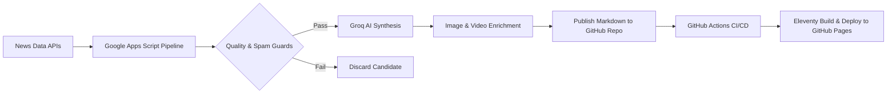

# SamacharDaily (समाचार डेली)

> An automated, AI-powered Indian & global news platform delivering fast, verified, and deeply contextualized reporting.

[](https://github.com/strngx/samachardaily/actions/workflows/deploy.yml)
[](LICENSE)
[](https://strngx.github.io/samachardaily/)

---

### 🌐 Live Publication
Explore the live, continuously updating newsroom:  
👉 **[https://strngx.github.io/samachardaily/](https://strngx.github.io/samachardaily/)**

---

## 📖 Overview

**SamacharDaily** is a modern, zero-cost digital news publication engineered for editorial credibility, rapid scanning, and search discoverability. Covering five core editorial desks — **India, World, Business, Tech, and Sports** — the platform autonomously ingests real-time wire dispatches, synthesizes high-quality journalistic briefings using large language models, enriches stories with verified media, and publishes directly to a static web frontend on an automated schedule.


---

## ✨ Features

- 🤖 **Autonomous Editorial Pipeline**: End-to-end automated news ingestion, duplicate detection, content-quality filtering, LLM-driven synthesis, and direct GitHub commit publishing.
- ⚡ **High-Performance Static Frontend**: Built with [Eleventy (11ty)](https://www.11ty.dev/) for instant page loads, zero database overhead, and resilient static hosting via GitHub Pages.
- 📰 **Structured Journalistic Story Format**: Every published article follows a rigorous editorial blueprint:
  - Authoritative headline & 1-2 sentence executive summary (*dek*)
  - 2-3 paragraph core factual synthesis
  - Dedicated **"Why It Matters"** analytical callout explaining strategic/market context
  - Forward-looking **"What Happens Next"** timeline
  - Validated 16:9 photography with photographer credit
  - Relevant broadcast video coverage with responsive YouTube embeds
  - Transparent primary wire source attribution
- 🔍 **Strict Content Quality & Policy Filters**: Automated guardrails to reject gambling/betting content, ticker-dumps, syndicated PR-wire spam, listicles, and non-English text.
- 🚀 **SEO & Discovery Ready**: Fully structured JSON-LD (`NewsArticle` and `VideoObject`), dynamic XML sitemaps, RSS 2.0 feeds, and OpenGraph/Twitter social cards.
- 💰 **Zero-Cost Architecture**: Built entirely on generous free tiers across Google Apps Script, Groq, News APIs, and GitHub Pages.

---

## 🛠️ Tech Stack

| Component | Technology / Service | Role in Pipeline |
| :--- | :--- | :--- |
| **Static Site Generator** | [Eleventy (11ty) v3](https://www.11ty.dev/) | Compiles Markdown and Nunjucks templates into ultra-fast static HTML |
| **Orchestration & Automation** | [Google Apps Script](https://developers.google.com/apps-script) | Serverless cron scheduling, candidate filtering, and GitHub REST API integration |
| **AI Editorial Synthesis** | [Groq](https://groq.com/) (Llama 3.3 / GPT-OSS) | High-velocity editorial rewriting, fact extraction, and analytical summaries |
| **News Sourcing** | [NewsData.io](https://newsdata.io/) & [Currents API](https://currentsapi.services/) | Real-time global wire ingestion across 5 focus desks |
| **Visual Media** | [Pexels API](https://www.pexels.com/api/) | High-resolution landscape photography with attribution metadata |
| **Video Journalism** | [YouTube Data API v3](https://developers.google.com/youtube/v3) | Broadcast journalism and video coverage search integration |
| **Hosting & CI/CD** | [GitHub Pages](https://pages.github.com/) & [GitHub Actions](https://github.com/features/actions) | Continuous deployment with 100% automated build pipeline |

---

## 🔄 How It Works



1. **Ingestion & Guardrails**: On an automated hourly/bi-hourly trigger, Google Apps Script fetches breaking dispatches from verified news wires and applies strict duplicate, language, spam, and policy filters.
2. **Editorial Synthesis**: A date-anchored Groq prompt synthesizes the dispatch into an objective news report complete with executive summary, analytical context, and forward-looking milestones.
3. **Media Enrichment**: The system validates source photography against hotlink and dimension constraints (falling back to Pexels when needed) and queries YouTube Data API for relevant broadcast reports.
4. **Autonomous Publishing**: The compiled Markdown article is committed directly to the appropriate category folder in GitHub via the GitHub REST API.
5. **Static Site Build**: The commit automatically triggers GitHub Actions, which builds the Eleventy static site and deploys it live to GitHub Pages in under 30 seconds.

---

## 📁 Repository Structure

```text
SamacharDaily/
├── .eleventy.js                     # Eleventy configuration, custom filters & collections
├── package.json                     # Project scripts and dependencies
├── Code.gs                          # Google Apps Script auto-blogger & orchestration engine
├── src/
│   ├── _data/
│   │   ├── site.js                  # Global metadata, navigation & SEO config
│   │   └── categories.js            # Category desk definitions & colors
│   ├── _includes/
│   │   ├── layouts/                 # Base, article, homepage & category layouts
│   │   └── partials/                # Reusable UI components (header, footer, cards, embeds)
│   ├── articles/                    # Published Markdown articles organized by desk
│   │   ├── india/
│   │   ├── world/
│   │   ├── business/
│   │   ├── tech/
│   │   └── sports/
│   ├── categories/                  # Dynamic category pages with pagination
│   ├── pages/                       # About, Contact, Privacy, Terms & Search pages
│   ├── feeds/                       # Dynamic XML Sitemap and RSS feeds
│   └── assets/                      # Production CSS tokens, client JS & brand assets
└── docs/                            # Documentation and repository preview assets
```

---

## 💻 Local Development

### Prerequisites
- **Node.js**: v18.0.0 or higher
- **npm**: v9.0.0 or higher

### Getting Started

1. **Clone the repository**:
   ```bash
   git clone https://github.com/strngx/samachardaily.git
   cd samachardaily
   ```

2. **Install dependencies**:
   ```bash
   npm install
   ```

3. **Start local development server**:
   ```bash
   npm run dev
   ```
   Open `http://localhost:8080` in your browser to view the site with hot-reloading.

4. **Build production bundle**:
   ```bash
   npm run build
   ```
   Generates optimized static HTML/CSS/JS into the `_site/` directory.

---

## 📄 License

This project is open source and available under the [MIT License](LICENSE).
