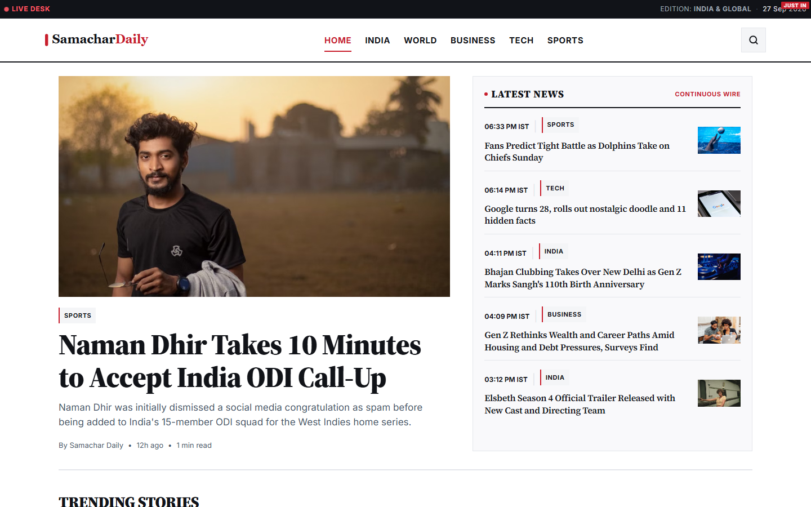
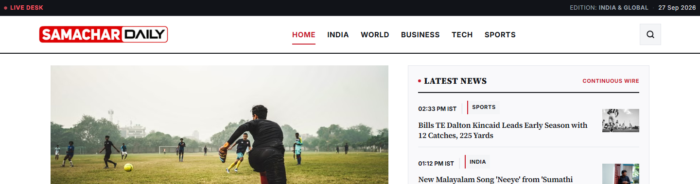
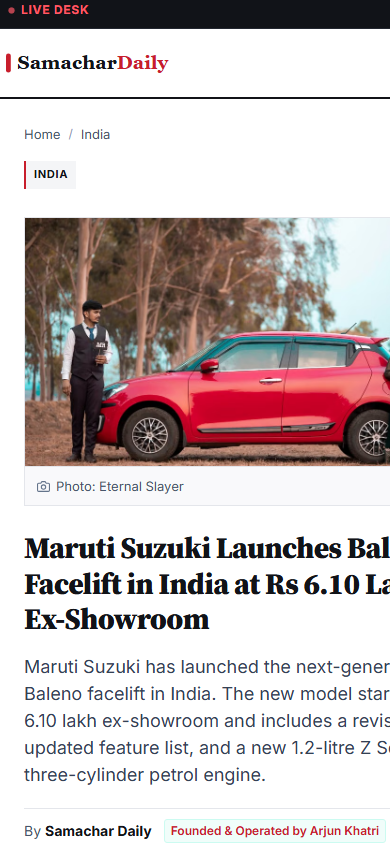

# Samachar Daily

> A solo-publisher digital newsroom built around transparent editorial workflows, source attribution, human review, and a modern Eleventy-based publishing stack.

[](https://github.com/strngx/samachardaily/actions/workflows/deploy.yml)
[](LICENSE)
[](https://thesamachardaily.in/)

---

## 🌐 Public Website

Explore the live, public news publication:  
👉 **[https://thesamachardaily.in/](https://thesamachardaily.in/)**

---

## 📸 Website Preview

### Desktop Homepage


### Navigation & Editorial Masthead


### Public Article Experience (Desktop & Mobile)
| Desktop Article View | Mobile Article View |
| :---: | :---: |
|  |  |

### Mobile Homepage
<p align="center">
  
</p>

---

## 📖 Project Overview

**Samachar Daily** is an independent digital news publication delivering verified, fast, and deeply contextualized journalism across India and the globe.

- **Solo-Publisher Model:** Founded, owned, and engineered by **Arjun Khatri**. The platform operates under an independent solo-publisher and solo-developer model, with technical architecture, editorial standards, and publishing pipelines managed directly by the founder.
- **Institutional Byline:** Published articles carry the institutional byline of the **[Samachar Daily Editorial Team](https://thesamachardaily.in/authors/samachardaily-editorial-team/)**.
- **AI as an Editorial Assistant:** Artificial intelligence is utilized strictly as an editorial assistant—accelerating dispatch synthesis, generating structured summaries, and organizing contextual timelines. It is never used as an autonomous reporter or fictitious author.
- **Human-in-the-Loop Review:** The editorial workflow incorporates human review checkpoints to evaluate factual fidelity, journalistic tone, and ethical compliance prior to publication.
- **Source Attribution:** Every published report clearly attributes the primary wire services, official statements, or research materials that informed the coverage.
- **Safeguards for Sensitive Topics:** Topics involving public health, civic grievances, or sensitive news events receive additional editorial review, dedicated disclaimers, and strict verification gates.

---

## 🏛️ Public Website Sections

The publication features five dedicated editorial desks alongside comprehensive institutional governance pages:

- **[India](https://thesamachardaily.in/india/):** National developments, governance, civic infrastructure, and legal analysis.
- **[World](https://thesamachardaily.in/world/):** International diplomacy, geopolitics, global trade, and strategic partnerships.
- **[Business](https://thesamachardaily.in/business/):** Financial markets, macroeconomic trends, corporate earnings, and policy shifts.
- **[Tech](https://thesamachardaily.in/tech/):** Artificial intelligence, consumer hardware, cybersecurity, software, and digital regulations.
- **[Sports](https://thesamachardaily.in/sports/):** Cricket, tournament coverage, athletics, and international competitive sports.
- **Article Pages:** High-readability typography, structured executive summaries, analytical *"Why It Matters"* breakdowns, and forward-looking *"What Happens Next"* timelines.
- **Governance & Legal:**
  - [About Us](https://thesamachardaily.in/about/)
  - [Editorial Policy & Standards](https://thesamachardaily.in/editorial/)
  - [Contact & Grievances](https://thesamachardaily.in/contact/)
  - [Privacy Policy](https://thesamachardaily.in/privacy/)
  - [Terms of Service](https://thesamachardaily.in/terms/)
  - [Search](https://thesamachardaily.in/search/)

---

## 🛠️ Technology Stack

The project relies on a clean, modern, zero-database static architecture:

- **Static Site Generator:** [Eleventy (11ty) v3](https://www.11ty.dev/) for high-speed static generation with zero client-side framework bloat.
- **Templating:** [Nunjucks](https://mozilla.github.io/nunjucks/) (`.njk`) layouts and Markdown (`.md`) content files.
- **Styling:** Semantic Vanilla CSS with custom typography, responsive CSS Grid / Flexbox layouts, and cohesive brand design tokens.
- **Frontend Logic:** Lightweight vanilla JavaScript for interactive elements (such as search and navigation toggles).
- **Automation Engine:** Google Apps Script (`Code.gs`) for serverless wire processing, candidate filtering, and dispatch enrichment.
- **Hosting & Infrastructure:** [GitHub Pages](https://pages.github.com/) serving optimized static HTML, CSS, and SVG/PNG assets over HTTPS.
- **CI/CD:** [GitHub Actions](https://github.com/features/actions) for automated build testing and production deployment.
- **Validation Suite:** Custom Node.js validation scripts verifying schema markup, canonical links, sitemaps, and RSS feeds.

---

## 🔄 Editorial Workflow

```text
  [Verified News Sources & Wires]
                 │
                 ▼
  [Research & Dispatch Cross-Checking]
                 │
                 ▼
  [AI-Assisted Synthesis & Drafting]
                 │
                 ▼
  [Automated Quality, Policy & Duplicate Filters]
                 │
                 ▼
  [Human Editorial Review & Fact Verification]
                 │
                 ▼
  [Local Promotion from Drafts to Production Articles]
                 │
                 ▼
  [Git Commit & Push to Main Branch]
                 │
                 ▼
  [GitHub Actions Build & Automated Deployment to GitHub Pages]
```

1. **Source Ingestion:** Dispatches are gathered from established news services, verified wires, and institutional announcements.
2. **Draft Generation:** Content is synthesized into structured journalistic reports with executive summaries, analytical context, and source citations.
3. **Independent Checks:** Stories are screened against strict anti-duplication algorithms, clickbait filters, policy rules, and metadata schemas.
4. **Editorial Review:** The publisher reviews drafts locally to ensure accuracy, proper tone, and context before publication.
5. **Promotion & Release:** Approved stories are promoted from the local draft pipeline into the production article directories and committed to source control.
6. **Static Compilation:** GitHub Actions builds the static site with Eleventy and deploys the output to GitHub Pages.

---

## 🛡️ Editorial Safeguards

- **Primary Source Attribution:** All stories cite primary news agencies or authoritative public disclosures.
- **Streamlined Article UX:** Articles feature a clean editorial hierarchy with compact byline metadata (`By Samachar Daily · Date · Read Time`) and a single transparent disclosure line (`AI-assisted wire synthesis · Verified · Editorial disclosure →`), avoiding heavy repeated publisher cards.
- **Conditional & Evidence-Based Modules:** Analytical callouts (*Key Takeaways* and *Why This Matters*) render only when the story possesses substantive reporting depth and documented evidence; they are omitted from brief wire notices.
- **Strict Video Relevance Guardrails:** Embedded media undergoes temporal and semantic validation. Stale historical footage, YouTube Shorts/Reels, commercial ads, and unrelated keyword collisions are automatically filtered out.
- **5-Tier Corpus Taxonomy:** The historical article corpus (~1,300 stories) is audited and categorized into a structured editorial taxonomy (Retain As-Is, High-Value Core, Needs Enrichment, Thin/Pruning Queue, and Historical Archive) to ensure thin wire briefs do not dilute homepage presentation.
- **No Fabricated Personas:** No artificial reporter bylines or invented personas are used.
- **No Hallucinated Quotes:** All quotes must originate directly from verified source dispatches.
- **Duplicate & Cannibalization Prevention:** Automated checks prevent publishing overlapping or redundant stories on the same event.
- **Health & Sensitive Content Disclaimers:** Articles touching on health or public safety include explicit editorial disclaimers directing readers to qualified professionals.
- **URL & Canonical Stability:** Permanent permalink structures and canonical link tags prevent search fragmentation.
- **Draft-First Staging:** Unpublished stories remain isolated in local staging (`src/drafts/`) until reviewed.

---

## 💻 Local Development

### Prerequisites
- **Node.js**: v18.0.0 or higher (v20+ recommended)
- **npm**: v9.0.0 or higher

### Installation & Commands

1. **Clone the repository:**
   ```bash
   git clone https://github.com/strngx/samachardaily.git
   cd samachardaily
   ```

2. **Install dependencies:**
   ```bash
   npm install
   ```

3. **Start local development server:**
   ```bash
   npm run dev
   # or: npm run serve
   ```
   Open `http://localhost:8080` in your browser to view the site with automatic hot-reloading.

4. **Build production static site:**
   ```bash
   npm run build
   ```
   Compiles optimized production HTML into the `_site/` directory.

5. **Run production validation suite:**
   ```bash
   node tools/validate-build.js
   ```
   Validates canonical tags, `NewsArticle` JSON-LD schemas, sitemap entries, and RSS feed structure.

6. **Launch local editorial dashboard:**
   ```bash
   npm run admin
   ```
   Starts a local-only preview environment with the internal editorial dashboard enabled.

---

## 🔒 Editorial Dashboard Isolation

The repository contains an internal editorial control center (`src/admin/`) used for reviewing draft queues, monitoring story health, and evaluating content quality locally.

**Key Security & Privacy Guarantees:**
- **Local-Only by Design:** The editorial dashboard is exclusively intended for local publisher operation.
- **Build Isolation:** In `.eleventy.js`, the production build process dynamically ignores `src/admin/**` unless the local development environment explicitly sets `SERVE_ADMIN=true`.
- **Zero Production Footprint:** The dashboard is never compiled into `_site/` during production builds and is never deployed to GitHub Pages.
- **Crawler Exclusion:** `src/robots.txt` explicitly disallows crawling of `/admin/`.
- **Data Protection:** Internal quality metrics, draft queues, and editorial notes remain strictly confidential on the publisher's local workstation.

---

## 📁 Project Structure

```text
SamacharDaily/
├── .eleventy.js                   # Eleventy SSG configuration & build isolation
├── package.json                   # Project dependencies and development scripts
├── Code.gs                        # Google Apps Script orchestration engine
├── LICENSE                        # MIT License
├── .github/
│   └── workflows/
│       └── deploy.yml             # GitHub Actions CI/CD deployment workflow
├── docs/
│   └── screenshots/               # Verified public website screenshots
│       ├── homepage-desktop.png
│       ├── homepage-mobile.png
│       ├── article-desktop.png
│       ├── article-mobile.png
│       └── navigation-desktop.png
├── scripts/                       # Draft review, promotion, and staging scripts
│   ├── promote_draft.js
│   ├── review_draft.js
│   └── stage_article.js
├── tools/                         # Build verification and QA scripts
│   ├── validate-build.js
│   ├── test-multi-source.js
│   ├── editorial-control-center/
│   └── seo-rehab-progress/
└── src/
    ├── _data/                     # Global site tokens, categories, and navigation
    ├── _includes/                 # Reusable Nunjucks layouts and UI partials
    │   ├── layouts/
    │   └── partials/
    ├── admin/                     # Local-only editorial dashboard (never published)
    ├── articles/                  # Production articles organized by desk
    │   ├── business/
    │   ├── india/
    │   ├── sports/
    │   ├── tech/
    │   └── world/
    ├── assets/                    # Production CSS, client JS, and brand graphics
    ├── categories/                # Dynamic category pages and pagination
    ├── drafts/                    # Staged drafts awaiting human review
    ├── feeds/                     # Dynamic XML sitemap and RSS feeds
    ├── pages/                     # Trust and governance pages (About, Policy, etc.)
    └── robots.txt                 # Search crawler instructions
```

---

## 🚀 Deployment

Deployment to production is handled entirely via **GitHub Actions** and **GitHub Pages**:

1. Changes are tested and validated locally.
2. Commits pushed to the `main` branch trigger the `.github/workflows/deploy.yml` workflow.
3. The workflow installs dependencies, executes `npm run build`, and verifies that `_site/` is populated with valid static assets.
4. The compiled `_site/` bundle is deployed automatically to GitHub Pages over HTTPS at `https://thesamachardaily.in/`.
5. The deployment job notifies search engines via Google's sitemap ping service.

---

## 🧪 Validation & Quality Assurance

Production readiness is verified using the repository's native validation tooling:

```bash
# 1. Clean production build
npm run build

# 2. Structural & schema validation
node tools/validate-build.js
```

The validation suite verifies:
- Production HTML generation for all core desks and article pages.
- Presence of valid canonical URLs on all public documents.
- Complete `NewsArticle` and `BreadcrumbList` JSON-LD structured data.
- Correct XML formatting and URL inclusion in `_site/sitemap.xml`.
- Valid RSS 2.0 feed formatting in `_site/rss.xml`.
- Complete absence of `_site/admin/` from the production build output.

---

## 📊 Repository Status

**Samachar Daily is actively maintained as a production static-news website.**

---

## 📄 License & Contact

- **License:** Open source under the [MIT License](LICENSE).
- **Founder & Owner:** Arjun Khatri
- **Editorial Desk:** [samachardaily.editorial@gmail.com](mailto:samachardaily.editorial@gmail.com)
- **Corrections & Inquiries:** [Contact & Grievances Page](https://thesamachardaily.in/contact/)
