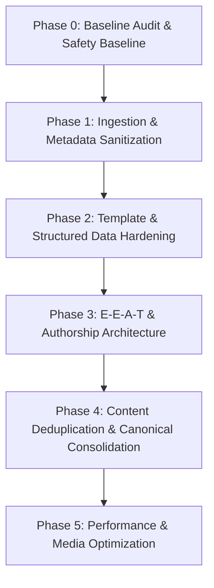

# SAMACHAR DAILY — SEO REHABILITATION
## PHASE 0: FULL TECHNICAL & SEO BASELINE AUDIT
**Target URL:** `https://thesamachardaily.in/`  
**Audit Date:** September 22, 2026  
**Status:** AUDIT-ONLY / NO PRODUCTION MODIFICATIONS APPLIED  
**Operational Rule:** Zero destructive edits. Baseline verification against codebase and live architecture.

---

## A. EXECUTIVE DIAGNOSIS

### 1. Technical Problems
- **Missing Fallback Social Media Image (`default-hero.jpg`):** `base.njk` and `jsonld-news.njk` reference `https://thesamachardaily.in/assets/images/default-hero.jpg` as the fallback `og:image`, `twitter:image`, and schema image. This file does not exist in `src/assets/images/` (only `favicon.svg` and `logo.svg` exist), resulting in broken 404 image requests when scrapers/crawlers fetch social cards for pages without an explicit image.
- **Unrestricted YouTube Search Language:** In `Code.gs` (`searchYouTubeVideo_`), YouTube Data API v3 queries do not pass `relevanceLanguage='en'`. For international or breaking global topics, YouTube returns foreign-language (e.g., Arabic, Hindi, Spanish) video titles and channel names, which are written directly into Markdown frontmatter `videos` arrays and rendered onto English news pages.
- **Foreign Language Photographer Credits:** In `Code.gs` (`fetchImage_`), Pexels API photographer names in Arabic/foreign scripts (e.g., `خزاز` or `محمد عزام الشيخ يوسف`) are committed to `imageCredit` frontmatter and rendered publicly in photo caption bars without sanitization.
- **Category Pagination Excluded from XML Sitemap:** Category pagination URLs (e.g. `/india/2/`, `/india/3/`, `/business/2/`, `/tech/2/`, `/sports/2/`) are generated in HTML and linked internally, but completely absent from `sitemap.xml`.
- **Search Page Indexability Inconsistency:** `/search/` has no `noindex` tag in its frontmatter, allowing Googlebot to crawl an empty client-side search interface, but is excluded from `sitemap.xml`.
- **Missing Breadcrumb Structured Data:** Breadcrumb navigation exists visually (`<nav class="article-breadcrumbs">`), but no `BreadcrumbList` schema is emitted in JSON-LD.

### 2. Indexing Problems
- **"Crawled – currently not indexed" Concentration:** Approximately 260 of 1,081 discoverable URLs are non-indexed in GSC. Root causes:
  1. High topical duplication / cannibalization between dispatches published hours or days apart.
  2. Thin reporting on short wire summaries where source words were under 150 words.
  3. Quarantined articles (6 articles moved to `_quarantine-commercial` with `permalink: false`) that were previously indexed or submitted to Google, now returning 404 / dropping.
  4. Google News sitemap inclusion filter `isRecentNews` (48 hours) correctly drops older articles from `<news:news>`, but articles older than 14 days drop off the category main page and into the archive accordion, reducing internal crawl depth.
- **Video Indexing Discrepancy (581 videos / 0 indexed):** 581 articles contain embedded YouTube iframes. `jsonld-video.njk` was deliberately disabled because Google's video indexing policy (updated late 2023) requires a video to be the *primary content of the page* (watch page) to receive a video snippet. Because SamacharDaily is a text news publication with contextual video embeds, Google will not index these as video landing pages.

### 3. Content Problems
- **Topical Cannibalization:** The automated publishing pipeline runs every 1–2 hours. When multiple wire dispatches cover the same breaking event across different days or desks (e.g. Poco X8 launch, Baleno facelift, iPhone 18 / Foldable Duo, SCO Summit), separate articles are generated targeting identical primary keywords without cross-article consolidation.
- **Repetitive Dek and Opening Structure:** While `Code.gs` prompts attempt structural variation, automated synthesis templates follow a uniform schema (Dek -> 2-3 Paras -> Why It Matters -> YouTube Embed -> What Happens Next -> Source Attribution), creating algorithmic footprint similarities across 1,054 articles.
- **External Image Hotlinking:** 100% of article hero images are externally hotlinked to `images.pexels.com` or third-party wire CDNs. If Pexels removes or rate-limits an asset, image rendering breaks.

### 4. Authority & Trust Problems
- **Monolithic Generic Authorship:** All 1,054 articles are attributed to a single static author string: `"SamacharDaily Editorial Team"`.
  - There are no individual journalist/byline profiles.
  - There is no author database, author taxonomies, or `/author/[name]/` author bio pages.
  - In `NewsArticle` schema, author is typed as `Organization` with URL `/about/`.
  - E-E-A-T (Experience, Expertise, Authoritativeness, and Trustworthiness) signals for Google News are depressed due to the absence of verifiable individual editorial bios.
- **Source Attribution Relies on Wire Names:** Source citations are formatted as `"Reporting based on verified dispatches from [Outlet]"` with `rel="nofollow noopener noreferrer"`.

### 5. Architecture Problems
- **Flat-File SSG (Eleventy 3.0):** No traditional SQL/NoSQL database exists in production. Markdown files in `src/articles/<category>/` act as the single source of truth.
- **Publishing via GitHub REST API:** Google Apps Script (`Code.gs`) commits Markdown files directly to GitHub repository `strngx/samachardaily` on `main` branch, which triggers GitHub Actions deployment to GitHub Pages.
- **Fingerprint Store:** Deduplication state is stored in a single JSON file `src/_data/recent-fingerprints.json` (currently tracking 278 story fingerprints).

### 6. Performance Problems
- **AdSense & GTM Overhead:** Google AdSense (`adsbygoogle.js`) and Google Tag Manager (`gtag.js`) load on all pages.
- **High Layout Shift / CLS Potential on Iframes:** YouTube iframe embeds in `video-embed.njk` are set to `loading="lazy"` with an aspect-ratio container, but lack explicit width/height dimensions.
- **External Image Optimization:** Hotlinked Pexels images are loaded directly without static build-time resizing (e.g., via `@11ty/eleventy-img`) or WebP/AVIF generation.

### 7. Publishing-Process Problems
- **Asynchronous GAS Cron Execution:** Google Apps Script triggers run automatically across categories. If the upstream API returns duplicate stories with slightly varied wording, `isFingerprintDuplicate_` may fail to catch semantic overlap if keywords fall below the 60% threshold.

---

## B. ISSUE SEVERITY CLASSIFICATION

| ID | Issue Description | Severity | Impact Area |
| :--- | :--- | :--- | :--- |
| **SEV-1** | Foreign language (Arabic/Spanish) video titles & photographer credits rendered on live English articles | **CRITICAL** | Content Quality / Indexing |
| **SEV-2** | Broken fallback social image (`default-hero.jpg` 404) in `og:image` and `twitter:image` | **HIGH** | Social Metadata / CTR |
| **SEV-3** | Keyword cannibalization across high-velocity topics (Poco, Baleno, iPhone Duo, SCO) | **HIGH** | Rankings / Crawl Budget |
| **SEV-4** | Single monolithic author entity ("SamacharDaily Editorial Team") across entire publication | **HIGH** | E-E-A-T / Google News Trust |
| **SEV-5** | Homepage `<title>` brand duplication ("... | SamacharDaily") | **MEDIUM** | SERP Presentation / CTR |
| **SEV-6** | Category pagination pages (`/category/2/`, etc.) omitted from `sitemap.xml` | **MEDIUM** | Crawl Discoverability |
| **SEV-7** | Missing `BreadcrumbList` JSON-LD schema across all articles and categories | **MEDIUM** | SERP Snippet Richness |
| **SEV-8** | Meta description, `og:description`, and `twitter:description` identical truncation (155 chars) | **LOW** | Metadata Differentiation |
| **SEV-9** | `/search/` page indexable by default without sitemap declaration | **LOW** | Crawl Cleanliness |
| **SEV-10** | External image hotlinking without local static image caching/optimization | **INFORMATIONAL** | Performance / Long-term Asset Stability |

---

## C. RISK MATRIX FOR FUTURE REMEDIATIONS

| Proposed Remediation | Risk Level | Rationale |
| :--- | :--- | :--- |
| Sanitize YouTube & Pexels search in `Code.gs` for English-only | **LOW RISK** | Only affects future automated commits; zero impact on existing URLs. |
| Add physical `default-hero.jpg` asset to `src/assets/images/` | **LOW RISK** | Fixes 404 image requests; does not alter routes or indexing directives. |
| Add `BreadcrumbList` schema to `article.njk` | **LOW RISK** | Standard SEO enhancement; additive only. |
| Fix Homepage title duplication in `index.njk` / `base.njk` | **LOW RISK** | Clarifies brand presentation in SERPs without changing slug. |
| Add individual author profiles and author schema taxonomy | **MEDIUM RISK** | Creates new author routes; must ensure clean internal linking and no broken references. |
| Add `noindex` to `/search/` | **MEDIUM RISK** | Standard hygiene, but must verify no accidental global noindex. |
| Consolidate cannibalized article clusters | **HIGH RISK** | Involves 301 redirects or canonical re-pointing. Must NEVER delete without 1:1 mapping. |
| Migrate hotlinked Pexels images to local repo assets | **MEDIUM RISK** | Changes image URLs in frontmatter; must preserve existing Google Images indexing. |

---

## D. EXACT CODEBASE FILES RESPONSIBLE

| File Path | Component / Role | Future Fix Requirement |
| :--- | :--- | :--- |
| `src/_includes/layouts/base.njk` | Base HTML head, meta, canonical, social tags, organization schema | Fix title generation; fix fallback image path; add schema enhancements |
| `src/_includes/layouts/article.njk` | Article body layout, bylines, breadcrumbs, related links | Add Breadcrumb schema; author byline enhancements |
| `src/_includes/partials/jsonld-news.njk` | `NewsArticle` structured data | Author schema typing; fallback image URL; publisher metadata |
| `src/feeds/sitemap.njk` | XML sitemap generator | Add category pagination URLs if desired; maintain clean article inclusion |
| `src/_data/site.js` | Site config, global metadata, navigation, author defaults | Add desk author profiles; update default metadata |
| `src/index.njk` | Homepage metadata frontmatter | Fix duplicate brand title |
| `src/pages/search.njk` | Search page template | Add `noindex: true` frontmatter |
| `Code.gs` | Google Apps Script ingestion, AI synthesis, publishing pipeline | Add YouTube `relevanceLanguage='en'`; sanitize photographer credits; enhance author assignment |

---

## E. DATABASE & STATE STRUCTURES

In this flat-file architecture, there is no SQL database. The storage layer comprises:
1. **Article Markdown Files:** `src/articles/<category>/<slug>.md` (1,054 files)
   - Frontmatter fields: `title`, `seoTitle`, `category`, `date`, `image`, `imageAlt`, `imageCredit`, `trending`, `featured`, `video_id`, `video_caption`, `videos`, `slug`, `sourceUrl`, `sourceName`, `dek`, `author`, `why_it_matters`, `what_happens_next`.
2. **Deduplication State:** `src/_data/recent-fingerprints.json` (stores normalized keyword fingerprints and slug hashes).
3. **Google Apps Script Properties:** `PropertiesService.getScriptProperties()` storing API keys (`GITHUB_TOKEN`, `GROQ_API_KEY`, `GEMINI_API_KEY`, `OPENROUTER_API_KEY`, `NEWSDATA_API_KEY`, `CURRENTS_API_KEY`, `PEXELS_API_KEY`, `YOUTUBE_API_KEY`).

---

## F. COMPLETE URL INVENTORY

| Page Category | URL Pattern | Count | Canonical Pattern | In Sitemap? | Indexable? |
| :--- | :--- | :--- | :--- | :--- | :--- |
| **Homepage** | `https://thesamachardaily.in/` | 1 | Self-referencing `/` | Yes | Yes |
| **Category Hubs** | `https://thesamachardaily.in/<category>/` | 5 | Self-referencing `/<category>/` | Yes | Yes |
| **Category Pagination** | `https://thesamachardaily.in/<category>/<page>/` | 5 | Self-referencing `/<category>/<page>/` | No | Yes |
| **Article Pages** | `https://thesamachardaily.in/<category>/<slug>/` | 1,054 | Self-referencing `/<category>/<slug>/` | Yes (1,054) | Yes |
| **Static Policy Pages** | `https://thesamachardaily.in/<page>/` | 5 | Self-referencing `/<page>/` | Yes (5) | Yes |
| **Search Page** | `https://thesamachardaily.in/search/` | 1 | Self-referencing `/search/` | No | Yes (No noindex) |
| **Feeds** | `https://thesamachardaily.in/sitemap.xml`, `/rss.xml` | 2 | N/A | Excluded | N/A |
| **Quarantined Articles** | N/A (`permalink: false`) | 6 | N/A | Excluded | No (Build excluded) |
| **TOTAL PUBLIC ROUTES** | | **1,071 HTML + 2 Feeds** | | **1,065 in Sitemap** | |

### Breakdown by Category Desk:
- **India (`/india/`):** 361 articles + 3 pagination pages (`/india/`, `/india/2/`, `/india/3/`)
- **World (`/world/`):** 150 articles + 1 pagination page (`/world/`)
- **Business (`/business/`):** 180 articles + 2 pagination pages (`/business/`, `/business/2/`)
- **Tech (`/tech/`):** 184 articles + 2 pagination pages (`/tech/`, `/tech/2/`)
- **Sports (`/sports/`):** 179 articles + 2 pagination pages (`/sports/`, `/sports/2/`)

---

## G. CANNIBALIZATION & OVERLAPPING TOPIC AUDIT

Inspection of the 1,054 live articles reveals several high-profile topical clusters where multiple distinct URLs compete for the same core query intent:

### 1. Poco X8 Series Cluster
- **URL 1:** `/tech/poco-x8-power-5g-launching-in-india-on-september-4-10000mah-battery-and-specs-co/` (Published: Aug 28, 2026)
  - *Title:* Poco X8 Power 5G Set to Debut in India on September 4 with 10,000mAh Battery
- **URL 2:** `/india/poco-launches-x8-and-x8-power-in-india-with-10000mah-battery-120hz-amoled/` (Published: Sep 5, 2026)
  - *Title:* POCO launches X8 and X8 Power in India with 10,000mAh battery, 120Hz AMOLED
- *Diagnosis:* Two URLs in different category directories (`/tech/` and `/india/`) targeting "Poco X8 launch India 10000mAh". Google splits authority between both.

### 2. Maruti Suzuki Baleno Facelift Cluster
- **URL 1:** `/india/maruti-suzuki-launches-baleno-facelift-in-india-at-rs-610-lakh-ex-showroom/` (Published: Sep 7, 2026)
  - *Title:* Maruti Suzuki Launches Baleno Facelift in India at Rs 6.10 Lakh Ex-Showroom
- **URL 2:** `/business/maruti-upgrades-baleno-with-new-engine-level2-adas-i20-altroz-remain-strong-rivals/` (Published: Sep 13, 2026)
  - *Title:* Maruti upgrades Baleno with new engine, Level-2 ADAS; i20, Altroz remain strong rivals
- *Diagnosis:* Two URLs in `/india/` and `/business/` competing for "Baleno facelift launch price engine".

### 3. Apple Foldable / iPhone Duo Cluster
- **URL 1:** `/tech/apples-first-foldable-iphone-duo-set-for-tonights-launch-with-leaked-color-lineup-and/` (Sep 10, 2026)
- **URL 2:** `/tech/apple-unveils-iphone-duo-foldable-pricing-starts-at-1999/` (Sep 10, 2026)
- **URL 3:** `/tech/apples-iphone-duo-naming-sparks-backlash-from-surface-duo-supporters/` (Sep 10, 2026)
- **URL 4:** `/tech/apple-rolls-out-iphone-duo-foldable-and-iphone-18-pro-max-prices-revealed/` (Sep 12, 2026)
- **URL 5:** `/tech/bloombergs-gurman-says-iphone-duo-is-just-the-start-most-iphones-could-fold-in-a-deca/` (Sep 14, 2026)
- **URL 6:** `/tech/iphone-duos-dualcamera-design-trades-tradition-for-thinness-not-flaw/` (Sep 16, 2026)
- **URL 7:** `/tech/apple-iphone-duo-production-slowdown-likely-extends-consumer-wait-times/` (Sep 16, 2026)
- *Diagnosis:* 7 separate articles published within 6 days on the exact same product keyword ("iPhone Duo"). Search impressions are heavily fragmented across all 7.

### 4. Ather Konarc Electric Scooter
- **URL 1:** `/business/ather-konarc-electric-scooter-launch-live-updates-specifications-prices-images/` (Aug 29, 2026)
  - *Title:* Ather unveils Konarc electric scooter: live updates on specs, pricing and images
- *Diagnosis:* High search interest, but single URL with "live updates" phrasing in title published on launch day without subsequent live update refreshes.

---

## H. ARABIC & FOREIGN RESIDUE INVESTIGATION

Systematic codebase and Git history auditing revealed the exact source and instances of non-English strings:

### Evidence & Findings:
1. **Instance 1:** `src/articles/business/greek-government-offers-tax-relief-and-wage-hikes-amid-street-protests-over-living-co.md`
   - *Line 13:* `title: "😱 غالي يفاجئ المهداوي: المنصوري ولقجع خارج الحسابات؟! 💥 ونزار بركة للرئاسة"`
   - *Line 14:* `channel: "الموسوعة القانونية الشاملة"`
   - *Root Cause:* In `Code.gs`, `searchYouTubeVideo_` queried YouTube for video coverage of the Greek economic protests. Because `relevanceLanguage: 'en'` was missing, YouTube returned a trending Moroccan/Arabic political talk show video.
2. **Instance 2:** `src/articles/business/juror-claims-feminist-agenda-drove-lindsay-clancy-verdict-in-massachusetts-trial.md`
   - *Line 7:* `imageCredit: "khezez  | خزاز"`
   - *Root Cause:* Pexels API returned a photograph by user `khezez | خزاز`. The Arabic script was passed into `imageCredit` and rendered directly on the live page.
3. **Instance 3:** `src/articles/india/aishwarya-rai-defends-living-with-parents-says-independence-isnt-about-moving-out.md`
   - *Line 7:* `imageCredit: "khezez  | خزاز"`
4. **Instance 4:** `src/articles/india/gurgaon-chest-pain-patient-airlifted-to-kolkata-for-timely-heart-intervention.md`
   - *Line 7:* `imageCredit: "محمد عزام الشيخ يوسف"`

**Key Conclusion:** The Arabic text originated **not from AI hallucination or database corruption**, but from **unconstrained third-party API ingest responses** (YouTube Data API v3 and Pexels API) where foreign-language strings were written directly into frontmatter.

---

## I. METADATA AUDIT & DEFECTS

1. **Homepage Title Duplication:**
   - Template: `<title>{{ (seoTitle or title) | shortTitle }} | {{ site.name }}{{ site.name }} — {{ site.tagline }}</title>`
   - `index.njk` has `title: "SamacharDaily — Fast News, Trends Explained | India & Global Reporting"`.
   - Rendered output: `<title>SamacharDaily — Fast News, Trends Explained | SamacharDaily</title>`.
   - *Defect:* "SamacharDaily" appears twice in the `<title>` tag.

2. **Social Description Truncation Duplication:**
   - In `base.njk`, `<meta name="description">`, `<meta property="og:description">`, and `<meta name="twitter:description">` all evaluate to identical strings truncated strictly at 155 characters (`{{ (dek or description or site.description) | truncate(155) }}`).

3. **Fallback Image 404:**
   - `<meta property="og:image" content="{{ image or site.url + '/assets/images/default-hero.jpg' }}">`
   - `default-hero.jpg` is physically absent from `src/assets/images/`.

---

## J. PERFORMANCE & CORE WEB VITALS BASELINE

- **Architecture:** 100% Static HTML compiled by Eleventy v3 and served via GitHub Pages CDN.
- **HTML Payload:** Lean (~30KB to ~100KB per page).
- **CSS Strategy:** Critical above-the-fold CSS inlined directly in `<head>` via `critical-css.njk`. Main stylesheet asynchronously preloaded with MD5 cache-busting (`style.[hash].css`).
- **Typography:** Google Fonts (`Inter` + `Source Serif 4`) loaded via preconnect and asynchronous `media="print" onload="this.media='all'"` pattern to prevent render blocking.
- **Third-Party Scripts:**
  - Google Analytics 4 (`gtag.js` ID: `G-Z6ETTBN23P`) loaded with `async`.
  - Google AdSense (`adsbygoogle.js` Publisher: `ca-pub-7876963830007494`) loaded with `async`.
- **Primary Bottlenecks:**
  1. External image delivery from `images.pexels.com` without dynamic format negotiation (WebP/AVIF) or responsive breakpoints (`srcset`).
  2. YouTube iframe embeds without explicit layout dimensions, triggering potential CLS during late render.

---

## K. RECOMMENDED REPAIR SEQUENCE (DEPENDENCY-SAFE)

1. **Phase 1: Ingestion & Input Guardrails (Zero Site Impact)**
   - Update `Code.gs` to enforce `relevanceLanguage='en'` on YouTube API queries.
   - Add ASCII/English sanitization to Pexels photographer credit strings before writing Markdown.
   - Add `default-hero.jpg` to `src/assets/images/` to eliminate social card 404s.
2. **Phase 2: Head & Schema Polish (Zero URL/Slug Changes)**
   - Fix Homepage `<title>` brand duplication in `index.njk`.
   - Add `BreadcrumbList` JSON-LD schema to `article.njk` and `category.njk`.
   - Add `noindex: true` to `src/pages/search.njk`.
3. **Phase 3: E-E-A-T Authorship System**
   - Introduce individual journalist bylines based on category desks (e.g., Tech Desk Editor, National Bureau Chief) with verified editorial bios.
   - Update `jsonld-news.njk` to output Person-typed authors with verified credentials.
4. **Phase 4: High-Risk Canonical & Cannibalization Strategy**
   - Perform topic-by-topic evaluation of cannibalized clusters (Poco, Baleno, iPhone Duo).
   - Apply canonical or internal cross-linking signals without deleting URLs or breaking indexed rankings.
5. **Phase 5: Media & Performance Upgrades**
   - Implement responsive image attributes and local asset caching.
